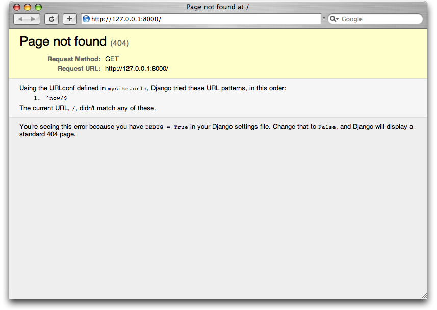

=============================
Chapter 3: Views and URLconfs
=============================

In the previous chapter, we explained how to set up a Django project and run the
Django development server. In this chapter, you'll learn the basics of creating
dynamic Web pages with Django.

Your First Django-Powered Page: Hello World
===========================================

As our first goal, let's create a Web page that outputs that famous example
message: "Hello world."

If you were publishing a simple "Hello world" Web page without a Web framework,
you'd simply type "Hello world" into a text file, call it ``hello.html``,
and upload it to a directory on a Web server somewhere. Notice, in that
process, you've specified two key pieces of information about that Web page:
its contents (the string ``"Hello world"``) and its URL (
``http://www.example.com/hello.html``, or maybe ``http://www.example.com/files/hello.html``
if you put it in a subdirectory).

With Django, you specify those same two things, but in a different way. The
contents of the page are produced by a *view function*, and the URL is
specified in a *URLconf*. First, let's write our "Hello world" view function.

Your First View
---------------

Within the ``mysite`` directory that ``django-admin.py startproject`` made in
the last chapter, create an empty file called ``views.py``. This Python module
will contain our views for this chapter. Note that there's nothing special
about the name ``views.py`` -- Django doesn't care what the file is called, as
you'll see in a bit -- but it's a good idea to call it ``views.py`` as a
convention, for the benefit of other developers reading your code.

Our "Hello world" view is simple. Here's the entire function, plus import
statements, which you should type into the ``views.py`` file::

    from django.http import HttpResponse

    def hello(request):
        return HttpResponse("Hello world")

Let's step through this code one line at a time:

* First, we import the class ``HttpResponse``, which lives in the
  ``django.http`` module. We need to import this class because it's used
  later in our code.

* Next, we define a function called ``hello`` -- the view function.

  Each view function takes at least one parameter, called ``request`` by
  convention. This is an object that contains information about the
  current Web request that has triggered this view, and it's an instance of
  the class ``django.http.HttpRequest``. In this example, we don't do
  anything with ``request``, but it must be the first parameter of the view
  nonetheless.

  Note that the name of the view function doesn't matter; it doesn't have
  to be named in a certain way in order for Django to recognize it. We're
  calling it ``hello`` here, because that name clearly indicates the gist
  of the view, but it could just as well be named
  ``hello_wonderful_beautiful_world``, or something equally revolting. The
  next section, "Your First URLconf", will shed light on how Django finds
  this function.

* The function is a simple one-liner: it merely returns an ``HttpResponse``
  object that has been instantiated with the text ``"Hello world"``.

The main lesson here is this: a view is just a Python function that takes an
``HttpRequest`` as its first parameter and returns an instance of
``HttpResponse``. In order for a Python function to be a Django view, it must
do these two things. (There are exceptions, but we'll get to those later.)

Your First URLconf
------------------

If, at this point, you ran ``python manage.py runserver`` again, you'd still
see the "Welcome to Django" message, with no trace of our "Hello world" view
anywhere. That's because our ``mysite`` project doesn't yet know about the
``hello`` view; we need to tell Django explicitly that we're activating this
view at a particular URL. (Continuing our previous analogy of publishing
static HTML files, at this point we've created the HTML file but haven't
uploaded it to a directory on the server yet.) To hook a view function to a
particular URL with Django, use a URLconf.

A *URLconf* is like a table of contents for your Django-powered Web site.
Basically, it's a mapping between URLs and the view functions that
should be called for those URLs. It's how you tell Django, "For this
URL, call this code, and for that URL, call that code." For example, "When
somebody visits the URL ``/foo/``, call the view function ``foo_view()``, which
lives in the Python module ``views.py``."

When you executed ``django-admin.py startproject`` in the previous chapter, the
script created a URLconf for you automatically: the file ``urls.py``. By
default, it looks something like this::

    from django.conf.urls import patterns, include, url

    # Uncomment the next two lines to enable the admin:
    # from django.contrib import admin
    # admin.autodiscover()

    urlpatterns = patterns('',
        # Examples:
        # url(r'^$', 'mysite.views.home', name='home'),
        # url(r'^mysite/', include('mysite.foo.urls')),

        # Uncomment the admin/doc line below to enable admin documentation:
        # url(r'^admin/doc/', include('django.contrib.admindocs.urls')),

        # Uncomment the next line to enable the admin:
        # url(r'^admin/', include(admin.site.urls)),
    )

This default URLconf includes some commonly used Django features commented out,
so that activating those features is as easy as uncommenting the appropriate
lines. If we ignore the commented-out code, here's the essence of a URLconf::

    from django.conf.urls.defaults import patterns, include, url

    urlpatterns = patterns('',
    )

Let's step through this code one line at a time:

* The first line imports three functions from the ``django.conf.urls.defaults``
  module, which is Django's URLconf infrastructure: ``patterns``, ``include``,
  and ``urls``.

* The second line calls the function ``patterns`` and saves the result
  into a variable called ``urlpatterns``. The ``patterns`` function gets
  passed only a single argument -- the empty string. (The string can be
  used to supply a common prefix for view functions, which we'll cover in
  :doc:`chapter08`.)

The main thing to note here is the variable ``urlpatterns``, which Django
expects to find in your URLconf module. This variable defines the mapping
between URLs and the code that handles those URLs. By default, as we can see,
the URLconf is empty -- your Django application is a blank slate. (As a side
note, that's how Django knew to show you the "Welcome to Django" page in the
last chapter. If your URLconf is empty, Django assumes you just started a new
project and, hence, displays that message.)

To add a URL and view to the URLconf, just add a mapping between a URL
pattern and the view function. Here's how to hook in our ``hello`` view::

    from django.conf.urls.defaults import patterns, include, url
    from mysite.views import hello

    urlpatterns = patterns('',
        url(r'^hello/$', hello),
    )

(Note that we've removed the commented-out code for brevity. You can choose
to leave those lines in, if you'd like.)

We made two changes here:

* First, we imported the ``hello`` view from its module --
  ``mysite/views.py``, which translates into ``mysite.views`` in Python
  import syntax. (This assumes ``mysite/views.py`` is on your Python path;
  see the sidebar for details.)

* Next, we added the line ``url(r'^hello/$', hello),`` to ``urlpatterns``. This
  line is referred to as a *URLpattern*. The ``url()`` function tells Django how
  to handle the url that you are configuring. The first argument is a
  pattern-matching string (a regular expression; more on this in a bit) and the
  second argument is the view function to use for that pattern. ``url()`` can
  take other optional arguments as well, which we'll cover in more depth in
  :doc:`chapter08`.

.. note::

  One more important detail we've introduced here is that ``r`` character in
  front of the regular expression string. This tells Python that the string is a
  "raw string" -- its contents should not interpret backslashes. In normal
  Python strings, backslashes are used for escaping special characters -- such
  as in the string ``'\n'``, which is a one-character string containing a
  newline. When you add the ``r`` to make it a raw string, Python does not apply
  its backslash escaping -- so, ``r'\n'`` is a two-character string containing a
  literal backslash and a lowercase "n". There's a natural collision between
  Python's usage of backslashes and the backslashes that are found in regular
  expressions, so it's strongly suggested that you use raw strings any time
  you're defining a regular expression in Python. All of the URLpatterns in this
  book will be raw strings.

In a nutshell, we just told Django that any request to the URL ``/hello/`` should
be handled by the ``hello`` view function.

.. admonition:: Your Python Path

    Your *Python path* is the list of directories on your system where Python
    looks when you use the Python ``import`` statement.

    For example, let's say your Python path is set to ``['',
    '/usr/lib/python2.7/site-packages', '/home/username/djcode']``. If you
    execute the Python statement ``from foo import bar``, Python will look for
    a module called ``foo.py`` in the current directory. (The first entry in the
    Python path, an empty string, means "the current directory.") If that file
    doesn't exist, Python will look for the file
    ``/usr/lib/python2.7/site-packages/foo.py``. If that file doesn't exist, it
    will try ``/home/username/djcode/foo.py``. Finally, if *that* file doesn't
    exist, it will raise ``ImportError``.

    If you're interested in seeing the value of your Python path, start the
    Python interactive interpreter and type this::

        >>> import sys
        >>> print sys.path

    Generally you don't have to worry about setting your Python path -- Python
    and Django take care of things for you automatically behind the scenes.
    (Setting the Python path is one of the things that the ``manage.py`` script
    does.)

It's worth discussing the syntax of this URLpattern, as it may not be
immediately obvious. Although we want to match the URL ``/hello/``, the pattern
looks a bit different than that. Here's why:

* Django removes the slash from the front of every incoming URL before it
  checks the URLpatterns. This means that our URLpattern doesn't include
  the leading slash in ``/hello/``. (At first, this may seem unintuitive,
  but this requirement simplifies things -- such as the inclusion of
  URLconfs within other URLconfs, which we'll cover in Chapter 8.)

* The pattern includes a caret (``^``) and a dollar sign (``$``). These are
  regular expression characters that have a special meaning: the caret
  means "require that the pattern matches the start of the string," and the
  dollar sign means "require that the pattern matches the end of the
  string."

  This concept is best explained by example. If we had instead used the
  pattern ``'^hello/'`` (without a dollar sign at the end), then *any* URL
  starting with ``/hello/`` would match, such as ``/hello/foo`` and
  ``/hello/bar``, not just ``/hello/``. Similarly, if we had left off the
  initial caret character (i.e., ``'hello/$'``), Django would match *any*
  URL that ends with ``hello/``, such as ``/foo/bar/hello/``. If we had
  simply used ``hello/``, without a caret *or* dollar sign, then any URL
  containing ``hello/`` would match, such as ``/foo/hello/bar``. Thus, we
  use both the caret and dollar sign to ensure that only the URL
  ``/hello/`` matches -- nothing more, nothing less.

  Most of your URLpatterns will start with carets and end with dollar
  signs, but it's nice to have the flexibility to perform more
  sophisticated matches.

  You may be wondering what happens if someone requests the URL ``/hello``
  (that is, *without* a trailing slash). Because our URLpattern requires a
  trailing slash, that URL would *not* match. However, by default, any
  request to a URL that *doesn't* match a URLpattern and *doesn't* end with
  a slash will be redirected to the same URL with a trailing slash. (This
  is regulated by the ``APPEND_SLASH`` Django setting, which is covered in
  Appendix D.)

  If you're the type of person who likes all URLs to end with slashes
  (which is the preference of Django's developers), all you'll need to do
  is add a trailing slash to each URLpattern and leave ``APPEND_SLASH`` set
  to ``True``. If you prefer your URLs *not* to have trailing slashes, or
  if you want to decide it on a per-URL basis, set ``APPEND_SLASH`` to
  ``False`` and put trailing slashes in your URLpatterns as you see fit.

The other thing to note about this URLconf is that we've passed the
``hello`` view function as an object without calling the function. This is a
key feature of Python (and other dynamic languages): functions are first-class
objects, which means you can pass them around just like any other variables.
Cool stuff, eh?

To test our changes to the URLconf, start the Django development server, as you
did in Chapter 2, by running the command ``python manage.py runserver``. (If you
left it running, that's fine, too. The development server automatically detects
changes to your Python code and reloads as necessary, so you don't have to
restart the server between changes.) The server is running at the address
``http://127.0.0.1:8000/``, so open up a Web browser and go to
``http://127.0.0.1:8000/hello/``. You should see the text "Hello world" -- the
output of your Django view.

Hooray! You've made your first Django-powered Web page.

.. admonition:: Regular Expressions

    *Regular expressions* (or *regexes*) are a compact way of specifying
    patterns in text. While Django URLconfs allow arbitrary regexes for
    powerful URL matching, you'll probably only use a few regex symbols in
    practice. Here's a selection of common symbols:

    ============  ==========================================================
    Symbol        Matches
    ============  ==========================================================
    ``.`` (dot)   Any single character

    ``\d``        Any single digit

    ``[A-Z]``     Any character between ``A`` and ``Z`` (uppercase)

    ``[a-z]``     Any character between ``a`` and ``z`` (lowercase)

    ``[A-Za-z]``  Any character between ``a`` and ``z`` (case-insensitive)

    ``+``         One or more of the previous expression (e.g., ``\d+``
                  matches one or more digits)

    ``[^/]+``     One or more characters until (and not including) a
                  forward slash

    ``?``         Zero or one of the previous expression (e.g., ``\d?``
                  matches zero or one digits)

    ``*``         Zero or more of the previous expression (e.g., ``\d*``
                  matches zero, one or more than one digit)

    ``{1,3}``     Between one and three (inclusive) of the previous
                  expression (e.g., ``\d{1,3}`` matches one, two or three
                  digits)
    ============  ==========================================================

    For more on regular expressions, see http://www.djangoproject.com/r/python/re-module/.

A Quick Note About 404 Errors
-----------------------------

At this point, our URLconf defines only a single URLpattern: the one that
handles requests to the URL ``/hello/``. What happens when you request a
different URL?

To find out, try running the Django development server and visiting a page such
as ``http://127.0.0.1:8000/goodbye/`` or
``http://127.0.0.1:8000/hello/subdirectory/``, or even ``http://127.0.0.1:8000/``
(the site "root"). You should see a "Page not found" message (see Figure 3-1).
Django displays this message because you requested a URL that's not defined in
your URLconf.

   Figure 3-1. Django's 404 page

The utility of this page goes beyond the basic 404 error message. It also tells
you precisely which URLconf Django used and every pattern in that URLconf. From
that information, you should be able to tell why the requested URL threw a 404.

Naturally, this is sensitive information intended only for you, the Web
developer. If this were a production site deployed live on the Internet, you
wouldn't want to expose that information to the public. For that reason, this
"Page not found" page is only displayed if your Django project is in *debug
mode*. We'll explain how to deactivate debug mode later. For now, just know
that every Django project is in debug mode when you first create it, and if the
project is not in debug mode, Django outputs a different 404 response.

A Quick Note About The Site Root
--------------------------------

As explained in the last section, you'll see a 404 error message if you view
the site root -- ``http://127.0.0.1:8000/``. Django doesn't add magically
anything to the site root; that URL is not special-cased in any way. It's up to
you to assign it to a URLpattern, just like every other entry in your URLconf.

The URLpattern to match the site root is a bit unintuitive, though, so it's
worth mentioning. When you're ready to implement a view for the site root, use
the URLpattern ``'^$'``, which matches an empty string. For example::

    from mysite.views import hello, my_homepage_view

    urlpatterns = patterns('',
        url(r'^$', my_homepage_view),
        # ...
    )

How Django Processes a Request
==============================

Before continuing to our second view function, let's pause to learn a little
more about how Django works. Specifically, when you view your "Hello world"
message by visiting ``http://127.0.0.1:8000/hello/`` in your Web browser, what
does Django do behind the scenes?

It all starts with the *settings file*. When you run ``python manage.py
runserver``, the script looks for a file called ``settings.py`` in the inner
``mysite`` directory. This file contains all sorts of configuration for this
particular Django project, all in uppercase: ``TEMPLATE_DIRS``, ``DATABASES``,
etc. The most important setting is called ``ROOT_URLCONF``. ``ROOT_URLCONF``
tells Django which Python module should be used as the URLconf for this Web
site.

Remember when ``django-admin.py startproject`` created the files
``settings.py`` and ``urls.py``? The autogenerated ``settings.py`` contains a
``ROOT_URLCONF`` setting that points to the autogenerated ``urls.py``. Open the
``settings.py`` file and see for yourself; it should look like this::

    ROOT_URLCONF = 'mysite.urls'

This corresponds to the file ``mysite/urls.py``.

When a request comes in for a particular URL -- say, a request for ``/hello/``
-- Django loads the URLconf pointed to by the ``ROOT_URLCONF`` setting. Then it
checks each of the URLpatterns in that URLconf, in order, comparing the
requested URL with the patterns one at a time, until it finds one that matches.
When it finds one that matches, it calls the view function associated with that
pattern, passing it an ``HttpRequest`` object as the first parameter. (We'll
cover the specifics of ``HttpRequest`` later.)

As we saw in our first view example, a view function must return an
``HttpResponse``. Once it does this, Django does the rest, converting the
Python object to a proper Web response with the appropriate HTTP headers and
body (i.e., the content of the Web page).

In summary:

1. A request comes in to ``/hello/``.
2. Django determines the root URLconf by looking at the ``ROOT_URLCONF``
   setting.
3. Django looks at all of the URLpatterns in the URLconf for the first one
   that matches ``/hello/``.
4. If it finds a match, it calls the associated view function.
5. The view function returns an ``HttpResponse``.
6. Django converts the ``HttpResponse`` to the proper HTTP response, which
   results in a Web page.

You now know the basics of how to make Django-powered pages. It's quite simple,
really -- just write view functions and map them to URLs via URLconfs.

Your Second View: Dynamic Content
=================================

Our "Hello world" view was instructive in demonstrating the basics of how
Django works, but it wasn't an example of a *dynamic* Web page, because the
content of the page are always the same. Every time you view ``/hello/``,
you'll see the same thing; it might as well be a static HTML file.

For our second view, let's create something more dynamic -- a Web page that
displays the current date and time. This is a nice, simple next step, because
it doesn't involve a database or any user input -- just the output of your
server's internal clock. It's only marginally more exciting than "Hello world,"
but it'll demonstrate a few new concepts.

This view needs to do two things: calculate the current date and time, and
return an ``HttpResponse`` containing that value. If you have experience with
Python, you know that Python includes a ``datetime`` module for calculating
dates. Here's how to use it::

    >>> import datetime
    >>> now = datetime.datetime.now()
    >>> now
    datetime.datetime(2008, 12, 13, 14, 9, 39, 2731)
    >>> print now
    2008-12-13 14:09:39.002731

That's simple enough, and it has nothing to do with Django. It's just Python
code. (We want to emphasize that you should be aware of what code is "just
Python" vs. code that is Django-specific. As you learn Django, we want you to
be able to apply your knowledge to other Python projects that don't necessarily
use Django.)

To make a Django view that displays the current date and time, then, we just
need to hook this ``datetime.datetime.now()`` statement into a view and return
an ``HttpResponse``. Here's how that looks::

    from django.http import HttpResponse
    import datetime

    def current_datetime(request):
        now = datetime.datetime.now()
        html = "<html><body>It is now %s.</body></html>" % now
        return HttpResponse(html)

As with our ``hello`` view function, this should live in ``views.py``. Note
that we've hidden the ``hello`` function from this example for brevity, but for
the sake of completeness, here's what the entire ``views.py`` looks like::

    from django.http import HttpResponse
    import datetime

    def hello(request):
        return HttpResponse("Hello world")

    def current_datetime(request):
        now = datetime.datetime.now()
        html = "<html><body>It is now %s.</body></html>" % now
        return HttpResponse(html)

(From now on, we won't display previous code in code examples, except when
necessary. You should be able to tell from context which parts of an example
are new vs. old.)

Let's step through the changes we've made to ``views.py`` to accommodate
the ``current_datetime`` view.

* We've added an ``import datetime`` to the top of the module, so we can
  calculate dates.

* The new ``current_datetime`` function calculates the current date and
  time, as a ``datetime.datetime`` object, and stores that as the local
  variable ``now``.

* The second line of code within the view constructs an HTML response using
  Python's "format-string" capability. The ``%s`` within the string is a
  placeholder, and the percent sign after the string means "Replace the
  ``%s`` in the preceding string with the value of the variable ``now``."
  The ``now`` variable is technically a ``datetime.datetime`` object, not
  a string, but the ``%s`` format character converts it to its string
  representation, which is something like ``"2008-12-13 14:09:39.002731"``.
  This will result in an HTML string such as
  ``"<html><body>It is now 2008-12-13 14:09:39.002731.</body></html>"``.

  (Yes, our HTML is invalid, but we're trying to keep the example simple
  and short.)

* Finally, the view returns an ``HttpResponse`` object that contains the
  generated response -- just as we did in ``hello``.

After adding that to ``views.py``, add the URLpattern to ``urls.py`` to tell
Django which URL should handle this view. Something like ``/time/`` would make
sense::

    from django.conf.urls.defaults import patterns, include, url
    from mysite.views import hello, current_datetime

    urlpatterns = patterns('',
        url(r'^hello/$', hello),
        url(r'^time/$', current_datetime),
    )

We've made two changes here. First, we imported the ``current_datetime``
function at the top. Second, and more importantly, we added a URLpattern
mapping the URL ``/time/`` to that new view. Getting the hang of this?

With the view written and URLconf updated, fire up the ``runserver`` and visit
``http://127.0.0.1:8000/time/`` in your browser. You should see the current
date and time.

.. admonition:: Django's Time Zone

    Depending on your computer, the date and time may be a few hours off.
    That's because Django is time zone-aware and defaults to the
    ``America/Chicago`` time zone. (It has to default to *something*, and that's
    the time zone where the original developers live.) If you live elsewhere,
    you'll want to change it in ``settings.py``. See the comment in that file
    for a link to an up-to-date list of worldwide time zone options.

URLconfs and Loose Coupling
===========================

Now's a good time to highlight a key philosophy behind URLconfs and behind
Django in general: the principle of *loose coupling*. Simply put, loose coupling
is a software-development approach that values the importance of making pieces
interchangeable. If two pieces of code are loosely coupled, then changes made to
one of the pieces will have little or no effect on the other.

Django's URLconfs are a good example of this principle in practice. In a Django
web application, the URL definitions and the view functions they call are
loosely coupled; that is, the decision of what the URL should be for a given
function, and the implementation of the function itself, reside in two separate
places. This lets you switch out one piece without affecting the other.

For example, consider our ``current_datetime`` view. If we wanted to change the
URL for the application -- say, to move it from ``/time/`` to
``/current-time/`` -- we could make a quick change to the URLconf, without
having to worry about the view itself. Similarly, if we wanted to change the
view function -- altering its logic somehow -- we could do that without
affecting the URL to which the function is bound.

Furthermore, if we wanted to expose the current-date functionality at
*several* URLs, we could easily take care of that by editing the URLconf,
without having to touch the view code. In this example, our
``current_datetime`` is available at two URLs. It's a contrived example, but
this technique can come in handy::

    urlpatterns = patterns('',
        url(r'^hello/$', hello),
        url(r'^time/$', current_datetime),
        url(r'^another-time-page/$', current_datetime),
    )

URLconfs and views are loose coupling in action. We'll continue to point out
examples of this important philosophy throughout this book.

Your Third View: Dynamic URLs
=============================

In our ``current_datetime`` view, the contents of the page -- the current
date/time -- were dynamic, but the URL (``/time/``) was static. In most dynamic
Web applications, though, a URL contains parameters that influence the output
of the page. For example, an online bookstore might give each book its own URL,
like ``/books/243/`` and ``/books/81196/``.

Let's create a third view that displays the current date and time offset by a
certain number of hours. The goal is to craft a site in such a way that the page
``/time/plus/1/`` displays the date/time one hour into the future, the page
``/time/plus/2/`` displays the date/time two hours into the future, the page
``/time/plus/3/`` displays the date/time three hours into the future, and so
on.

A novice might think to code a separate view function for each hour offset,
which might result in a URLconf like this::

    urlpatterns = patterns('',
        url(r'^time/$', current_datetime),
        url(r'^time/plus/1/$', one_hour_ahead),
        url(r'^time/plus/2/$', two_hours_ahead),
        url(r'^time/plus/3/$', three_hours_ahead),
        url(r'^time/plus/4/$', four_hours_ahead),
    )

Clearly, this line of thought is flawed. Not only would this result in redundant
view functions, but also the application is fundamentally limited to supporting
only the predefined hour ranges -- one, two, three or four hours. If we decided
to create a page that displayed the time *five* hours into the future, we'd
have to create a separate view and URLconf line for that, furthering the
duplication. We need to do some abstraction here.

.. admonition:: A Word About Pretty URLs

    If you're experienced in another Web development platform, such as PHP or
    Java, you may be thinking, "Hey, let's use a query string parameter!" --
    something like ``/time/plus?hours=3``, in which the hours would be
    designated by the ``hours`` parameter in the URL's query string (the part
    after the ``?``).

    You *can* do that with Django (and we'll tell you how in Chapter 7), but
    one of Django's core philosophies is that URLs should be beautiful. The URL
    ``/time/plus/3/`` is far cleaner, simpler, more readable, easier to recite
    to somebody aloud and . . . just plain prettier than its query string
    counterpart. Pretty URLs are a characteristic of a quality Web application.

    Django's URLconf system encourages pretty URLs by making it easier to use
    pretty URLs than *not* to.

How, then do we design our application to handle arbitrary hour offsets? The
key is to use *wildcard URLpatterns*. As we mentioned previously, a URLpattern
is a regular expression; hence, we can use the regular expression pattern
``\d+`` to match one or more digits::

    urlpatterns = patterns('',
        # ...
        url(r'^time/plus/\d+/$', hours_ahead),
        # ...
    )

(We're using the ``# ...`` to imply there might be other URLpatterns that we
trimmed from this example.)

This new URLpattern will match any URL such as ``/time/plus/2/``,
``/time/plus/25/``, or even ``/time/plus/100000000000/``. Come to think of it,
let's limit it so that the maximum allowed offset is 99 hours. That means we
want to allow either one- or two-digit numbers -- and in regular expression
syntax, that translates into ``\d{1,2}``::

    url(r'^time/plus/\d{1,2}/$', hours_ahead),

.. note::

    When building Web applications, it's always important to consider the most
    outlandish data input possible, and decide whether or not the application
    should support that input. We've curtailed the outlandishness here by
    limiting the offset to 99 hours.

Now that we've designated a wildcard for the URL, we need a way of passing that
wildcard data to the view function, so that we can use a single view function
for any arbitrary hour offset. We do this by placing parentheses around the
data in the URLpattern that we want to save. In the case of our example, we
want to save whatever number was entered in the URL, so let's put parentheses
around the ``\d{1,2}``, like this::

    url(r'^time/plus/(\d{1,2})/$', hours_ahead),

If you're familiar with regular expressions, you'll be right at home here;
we're using parentheses to *capture* data from the matched text.

The final URLconf, including our previous two views, looks like this::

    from django.conf.urls.defaults import *
    from mysite.views import hello, current_datetime, hours_ahead

    urlpatterns = patterns('',
        url(r'^hello/$', hello),
        url(r'^time/$', current_datetime),
        url(r'^time/plus/(\d{1,2})/$', hours_ahead),
    )

With that taken care of, let's write the ``hours_ahead`` view.

``hours_ahead`` is very similar to the ``current_datetime`` view we wrote
earlier, with a key difference: it takes an extra argument, the number of hours
of offset. Here's the view code::

    from django.http import Http404, HttpResponse
    import datetime

    def hours_ahead(request, offset):
        try:
            offset = int(offset)
        except ValueError:
            raise Http404()
        dt = datetime.datetime.now() + datetime.timedelta(hours=offset)
        html = "<html><body>In %s hour(s), it will be %s.</body></html>" % (offset, dt)
        return HttpResponse(html)

Let's step through this code one line at a time:

* The view function, ``hours_ahead``, takes *two* parameters: ``request``
  and ``offset``.

  * ``request`` is an ``HttpRequest`` object, just as in ``hello`` and
    ``current_datetime``. We'll say it again: each view *always* takes an
    ``HttpRequest`` object as its first parameter.

  * ``offset`` is the string captured by the parentheses in the
    URLpattern. For example, if the requested URL were ``/time/plus/3/``,
    then ``offset`` would be the string ``'3'``. If the requested URL were
    ``/time/plus/21/``, then ``offset`` would be the string ``'21'``. Note
    that captured values will always be *strings*, not integers, even if
    the string is composed of only digits, such as ``'21'``.

    (Technically, captured values will always be *Unicode objects*, not
    plain Python bytestrings, but don't worry about this distinction at
    the moment.)

    We decided to call the variable ``offset``, but you can call it
    whatever you'd like, as long as it's a valid Python identifier. The
    variable name doesn't matter; all that matters is that it's the second
    argument to the function, after ``request``. (It's also possible to
    use keyword, rather than positional, arguments in an URLconf. We cover
    that in Chapter 8.)

* The first thing we do within the function is call ``int()`` on ``offset``.
  This converts the string value to an integer.

  Note that Python will raise a ``ValueError`` exception if you call
  ``int()`` on a value that cannot be converted to an integer, such as the
  string ``'foo'``. In this example, if we encounter the ``ValueError``, we
  raise the exception ``django.http.Http404``, which, as you can imagine,
  results in a 404 "Page not found" error.

  Astute readers will wonder: how could we ever reach the ``ValueError``
  case, anyway, given that the regular expression in our URLpattern --
  ``(\d{1,2})`` -- captures only digits, and therefore ``offset`` will only
  ever be a string composed of digits? The answer is, we won't, because
  the URLpattern provides a modest but useful level of input validation,
  *but* we still check for the ``ValueError`` in case this view function
  ever gets called in some other way. It's good practice to implement view
  functions such that they don't make any assumptions about their
  parameters. Loose coupling, remember?

* In the next line of the function, we calculate the current date/time and
  add the appropriate number of hours. We've already seen
  ``datetime.datetime.now()`` from the ``current_datetime`` view; the new
  concept here is that you can perform date/time arithmetic by creating a
  ``datetime.timedelta`` object and adding to a ``datetime.datetime``
  object. Our result is stored in the variable ``dt``.

  This line also shows why we called ``int()`` on ``offset`` -- the
  ``datetime.timedelta`` function requires the ``hours`` parameter to be an
  integer.

* Next, we construct the HTML output of this view function, just as we did
  in ``current_datetime``. A small difference in this line from the previous
  line is that it uses Python's format-string capability with *two* values,
  not just one. Hence, there are two ``%s`` symbols in the string and a
  tuple of values to insert: ``(offset, dt)``.

* Finally, we return an ``HttpResponse`` of the HTML. By now, this is old
  hat.

With that view function and URLconf written, start the Django development server
(if it's not already running), and visit ``http://127.0.0.1:8000/time/plus/3/``
to verify it works. Then try ``http://127.0.0.1:8000/time/plus/5/``. Then
``http://127.0.0.1:8000/time/plus/24/``. Finally, visit
``http://127.0.0.1:8000/time/plus/100/`` to verify that the pattern in your
URLconf only accepts one- or two-digit numbers; Django should display a "Page
not found" error in this case, just as we saw in the section "A Quick Note
About 404 Errors" earlier. The URL ``http://127.0.0.1:8000/time/plus/`` (with
*no* hour designation) should also throw a 404.

.. admonition:: Coding Order

    In this example, we wrote the URLpattern first and the view second, but in
    the previous examples, we wrote the view first, then the URLpattern. Which
    technique is better?

    Well, every developer is different.

    If you're a big-picture type of person, it may make the most sense to you
    to write all of the URLpatterns for your application at the same time, at
    the start of your project, and then code up the views. This has the
    advantage of giving you a clear to-do list, and it essentially defines the
    parameter requirements for the view functions you'll need to write.

    If you're more of a bottom-up developer, you might prefer to write the
    views first, and then anchor them to URLs afterward. That's OK, too.

    In the end, it comes down to which technique fits your brain the best. Both
    approaches are valid.

Django's Pretty Error Pages
===========================

Take a moment to admire the fine Web application we've made so far . . . now
let's break it! Let's deliberately introduce a Python error into our
``views.py`` file by commenting out the ``offset = int(offset)`` lines in the
``hours_ahead`` view::

    def hours_ahead(request, offset):
        # try:
        #     offset = int(offset)
        # except ValueError:
        #     raise Http404()
        dt = datetime.datetime.now() + datetime.timedelta(hours=offset)
        html = "<html><body>In %s hour(s), it will be %s.</body></html>" % (offset, dt)
        return HttpResponse(html)

Load up the development server and navigate to ``/time/plus/3/``. You'll see an
error page with a significant amount of information, including a ``TypeError``
message displayed at the very top: ``"unsupported type for timedelta hours
component: unicode"``.

What happened? Well, the ``datetime.timedelta`` function expects the ``hours``
parameter to be an integer, and we commented out the bit of code that converted
``offset`` to an integer. That caused ``datetime.timedelta`` to raise the
``TypeError``. It's the typical kind of small bug that every programmer runs
into at some point.

The point of this example was to demonstrate Django's error pages. Take some
time to explore the error page and get to know the various bits of information
it gives you.

Here are some things to notice:

* At the top of the page, you get the key information about the exception:
  the type of exception, any parameters to the exception (the ``"unsupported
  type"`` message in this case), the file in which the exception was raised,
  and the offending line number.

* Under the key exception information, the page displays the full Python
  traceback for this exception. This is similar to the standard traceback
  you get in Python's command-line interpreter, except it's more
  interactive. For each level ("frame") in the stack, Django displays the
  name of the file, the function/method name, the line number, and the
  source code of that line.

  Click the line of source code (in dark gray), and you'll see several
  lines from before and after the erroneous line, to give you context.

  Click "Local vars" under any frame in the stack to view a table of all
  local variables and their values, in that frame, at the exact point in the
  code at which the exception was raised. This debugging information can be
  a great help.

* Note the "Switch to copy-and-paste view" text under the "Traceback"
  header. Click those words, and the traceback will switch to a alternate
  version that can be easily copied and pasted. Use this when you want to
  share your exception traceback with others to get technical support --
  such as the kind folks in the Django IRC chat room or on the Django users
  mailing list.

  Underneath, the "Share this traceback on a public Web site" button will
  do this work for you in just one click. Click it to post the traceback to
  http://www.dpaste.com/, where you'll get a distinct URL that you can
  share with other people.

* Next, the "Request information" section includes a wealth of information
  about the incoming Web request that spawned the error: GET and POST
  information, cookie values, and meta information, such as CGI headers.
  Appendix G has a complete reference of all the information a request
  object contains.

  Below the "Request information" section, the "Settings" section lists all
  of the settings for this particular Django installation. (We've already
  mentioned ``ROOT_URLCONF``, and we'll show you various Django settings
  throughout the book. All the available settings are covered in detail in
  Appendix D.)

The Django error page is capable of displaying more information in certain
special cases, such as the case of template syntax errors. We'll get to those
later, when we discuss the Django template system. For now, uncomment the
``offset = int(offset)`` lines to get the view function working properly again.

Are you the type of programmer who likes to debug with the help of carefully
placed ``print`` statements? You can use the Django error page to do so -- just
without the ``print`` statements. At any point in your view, temporarily insert
an ``assert False`` to trigger the error page. Then, you can view the local
variables and state of the program. Here's an example, using the
``hours_ahead`` view::

    def hours_ahead(request, offset):
        try:
            offset = int(offset)
        except ValueError:
            raise Http404()
        dt = datetime.datetime.now() + datetime.timedelta(hours=offset)
        assert False
        html = "<html><body>In %s hour(s), it will be %s.</body></html>" % (offset, dt)
        return HttpResponse(html)

Finally, it's obvious that much of this information is sensitive -- it exposes
the innards of your Python code and Django configuration -- and it would be
foolish to show this information on the public Internet. A malicious person
could use it to attempt to reverse-engineer your Web application and do nasty
things. For that reason, the Django error page is only displayed when your
Django project is in debug mode. We'll explain how to deactivate debug mode
in Chapter 12. For now, just know that every Django project is in debug mode
automatically when you start it. (Sound familiar? The "Page not found" errors,
described earlier in this chapter, work the same way.)

What's next?
============

So far, we've been writing our view functions with HTML hard-coded directly
in the Python code. We've done that to keep things simple while we demonstrated
core concepts, but in the real world, this is nearly always a bad idea.

Django ships with a simple yet powerful template engine that allows you to
separate the design of the page from the underlying code. We'll dive into
Django's template engine in the :doc:`next chapter <chapter04>`.
