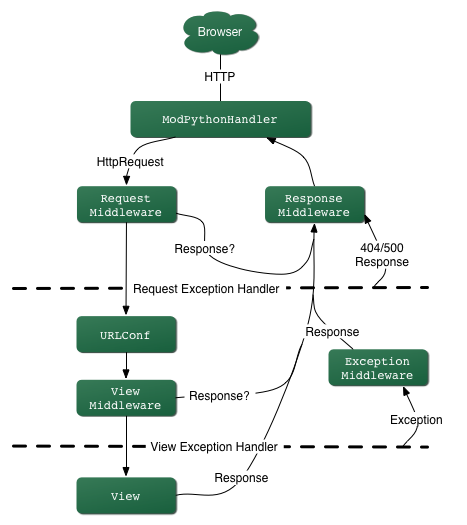

==========================================
Chapter 3: The Basics of Dynamic Web Pages
==========================================

In the previous chapter, we explained how to set up a Django project and run the
Django development server. Of course, that site doesn't actually do anything
useful yet--all it does is display the "It worked!" message. Let's change that.
This chapter introduces how to create dynamic Web pages with Django.

Your First View: Dynamic Content
================================

As our first goal, let's create a Web page that displays the current date and
time. This is a good example of a *dynamic* Web page, because the contents of
the page are not static--rather, the contents change according to the result of
a computation (in this case, a calculation of the current time). This simple
example doesn't involve a database or any sort of user input--just the output of
your server's internal clock.

To create this page, we'll write a *view function*. A view function, or *view*
for short, is simply a Python function that takes a Web request and returns a
Web response. This response can be the HTML contents of a Web page, or a
redirect, or a 404 error, or an XML document, or an image . . . or anything,
really. The view itself contains whatever arbitrary logic is necessary to return
that response. This code can live anywhere you want, as long as it's on your
Python path. There's no other requirement--no "magic," so to speak. For the sake
of putting the code *somewhere*, let's create a file called ``views.py`` in the
``mysite`` directory, which you created in the previous chapter.

Here's a view that returns the current date and time, as an HTML document::

    from django.http import HttpResponse
    import datetime

    def current_datetime(request):
        now = datetime.datetime.now()
        html = "<html><body>It is now %s.</body></html>" % now
        return HttpResponse(html)

Let's step through this code one line at a time:

    * First, we import the class ``HttpResponse``, which lives in the
      ``django.http`` module. See Appendix H for further details on the
      ``HttpRequest`` and ``HttpResponse`` objects.

    * Then we import the ``datetime`` module from Python's standard library, the
      set of useful modules that comes with Python. The ``datetime`` module
      contains several functions and classes for dealing with dates and times,
      including a function that returns the current time.

    * Next, we define a function called ``current_datetime``. This is the view
      function. Each view function takes an ``HttpRequest`` object as its first
      parameter, which is typically named ``request``.

      Note that the name of the view function doesn't matter; it doesn't have to
      be named in a certain way in order for Django to recognize it. We're
      calling it ``current_datetime`` here, because that name clearly indicates
      what it does, but it could just as well be named
      ``super_duper_awesome_current_time``, or something equally revolting.
      Django doesn't care. The next section explains how Django finds this
      function.

    * The first line of code within the function calculates the current
      date/time, as a ``datetime.datetime`` object, and stores that as the local
      variable ``now``.

    * The second line of code within the function constructs an HTML response
      using Python's format-string capability. The ``%s`` within the string is a
      placeholder, and the percent sign after the string means "Replace the
      ``%s`` with the value of the variable ``now``." (Yes, the HTML is invalid,
      but we're trying to keep the example simple and short.)

    * Finally, the view returns an ``HttpResponse`` object that contains the
      generated response. Each view function is responsible for returning an
      ``HttpResponse`` object. (There are exceptions, but we'll get to those
      later.)

.. admonition:: Django's Time Zone

    Django includes a ``TIME_ZONE`` setting that defaults to
    ``America/Chicago``. This probably isn't where you live, so you might want
    to change it in your ``settings.py``.  See Appendix E for details.

Mapping URLs to Views
=====================

So, to recap, this view function returns an HTML page that includes the current
date and time. But how do we tell Django to use this code? That's where
*URLconfs* come in.

A *URLconf* is like a table of contents for your Django-powered Web site.
Basically, it's a mapping between URL patterns and the view functions that
should be called for those URL patterns. It's how you tell Django, "For this
URL, call this code, and for that URL, call that code." Remember that the view
functions need to be on the Python path.

.. admonition:: Your Python Path

    Your *Python path* is the list of directories on your system where Python
    looks when you use the Python ``import`` statement.

    For example, let's say your Python path is set to ``['',
    '/usr/lib/python2.4/site-packages', '/home/username/djcode/']``. If you
    execute the Python code ``from foo import bar``, Python will first check for
    a module called ``foo.py`` in the current directory. (The first entry in the
    Python path, an empty string, means "the current directory.") If that file
    doesn't exist, Python will look for the file
    ``/usr/lib/python2.4/site-packages/foo.py``. If that file doesn't exist, it
    will try ``/home/username/djcode/foo.py``. Finally, if *that* file doesn't
    exist, it will raise ``ImportError``.

    If you're interested in seeing the value of your Python path, start the
    Python interactive interpreter and type ``import sys``, followed by ``print
    sys.path``.

    Generally you don't have to worry about setting your Python path--Python and
    Django will take care of things for you automatically behind the scenes. (If
    you're curious, setting the Python path is one of the things that the
    ``manage.py`` file does.)

When you executed ``django-admin.py startproject`` in the previous chapter, the
script created a URLconf for you automatically: the file ``urls.py``. Let's edit
that file. By default, it looks something like this::

    from django.conf.urls.defaults import *

    urlpatterns = patterns('',
        # Example:
        # (r'^mysite/', include('mysite.apps.foo.urls.foo')),

        # Uncomment this for admin:
    #     (r'^admin/', include('django.contrib.admin.urls')),
    )

Let's step through this code one line at a time:

    * The first line imports all objects from the ``django.conf.urls.defaults``
      module, including a function called ``patterns``.

    * The second line calls the function ``patterns()`` and saves the result
      into a variable called ``urlpatterns``. The ``patterns()`` function gets
      passed only a single argument--the empty string. The rest of the lines
      are commented out. (The string can be used to supply a common prefix for
      view functions, but we'll skip this advanced usage for now.)

The main thing to note here is the variable ``urlpatterns``, which Django
expects to find in your ``ROOT_URLCONF`` module. This variable defines the
mapping between URLs and the code that handles those URLs.

By default, everything in the URLconf is commented out--your Django application
is a blank slate. (As a side note, that's how Django knew to show you the "It
worked!" page in the last chapter. If your URLconf is empty, Django assumes you
just started a new project and, hence, displays that message.)

Let's edit this file to expose our ``current_datetime`` view::

    from django.conf.urls.defaults import *
    from mysite.views import current_datetime

    urlpatterns = patterns('',
        (r'^time/$', current_datetime),
    )

We made two changes here. First, we imported the ``current_datetime`` view from
its module (``mysite/views.py``, which translates into ``mysite.views`` in
Python import syntax). Next, we added the line ``(r'^time/$',
current_datetime),``. This line is referred to as a *URLpattern*--it's a Python
tuple in which the first element is a simple regular expression and the second
element is the view function to use for that pattern.

In a nutshell, we just told Django that any request to the URL ``/time/`` should
be handled by the ``current_datetime`` view function.

A few things are worth pointing out:

    * Note that, in this example, we passed the ``current_datetime`` view
      function as an object without calling the function. This is a key feature
      of Python (and other dynamic languages): functions are first-class
      objects, which means you can pass them around just like any other
      variables. Cool stuff, eh?

    * The ``r`` in ``r'^time/$'`` means that ``'^time/$`` is a Python raw
      string. This allows regular expressions to be written without overly
      verbose escaping.

    * You should exclude the expected slash at the beginning of the
      ``'^time/$'`` expression in order to match ``/time/``. Django
      automatically puts a slash before every expression. At first glance, this
      may seem odd, but URLconfs can be included in other URLconfs, and leaving
      off the leading slash simplifies matters. This is further covered in
      Chapter 8.

    * The caret character (``^``) and dollar sign character (``$``) are
      important. The caret means "require that the pattern matches the start of
      the string," and the dollar sign means "require that the pattern matches
      the end of the string."

      This concept is best explained by example. If we had instead used the
      pattern ``'^time/'`` (without a dollar sign at the end), then *any* URL
      that starts with ``time/`` would match, such as ``/time/foo`` and
      ``/time/bar``, not just ``/time/``. Similarly, if we had left off the
      initial caret character (``'time/$'``), Django would match *any* URL that
      ends with ``time/``, such as ``/foo/bar/time/``. Thus, we use both the
      caret and dollar sign to ensure that only the URL ``/time/`` matches.
      Nothing more, nothing less.

      You may be wondering what happens if someone requests ``/time``. This is
      handled as you'd hope (via a redirect) as long as the ``APPEND_SLASH``
      setting is ``True``. (See Appendix E for some good bedtime reading on this
      topic.)

To test our changes to the URLconf, start the Django development server, as you
did in Chapter 2, by running the command ``python manage.py runserver``. (If you
left it running, that's fine, too. The development server automatically detects
changes to your Python code and reloads as necessary, so you don't have to
restart the server between changes.) The server is running at the address
``http://127.0.0.1:8000/``, so open up a Web browser and go to
``http://127.0.0.1:8000/time/``. You should see the output of your Django view.

Hooray! You've made your first Django-powered Web page.

.. admonition:: Regular Expressions

    *Regular expressions* (or *regexes*) are a compact way of specifying
    patterns in text. While Django URLconfs allow arbitrary regexes for powerful
    URL-matching capability, you'll probably use only a few regex patterns in
    practice. Here's a small selection of common patterns:

        ============  ==========================================================
        Symbol        Matches
        ============  ==========================================================
        ``.`` (dot)   Any character

        ``\d``        Any digit

        ``[A-Z]``     Any character, A-Z (uppercase)

        ``[a-z]``     Any character, a-z (lowercase)

        ``[A-Za-z]``  Any character, a-z (case insensitive)

        ``+``         One or more of the previous expression (e.g., ``\d+``
                      matches one or more digit)

        ``[^/]+``     All characters except forward slash

        ``?``         Zero or more of the previous expression (e.g., ``\d*``
                      matches zero or more digits)

        ``{1,3}``     Between one and three (inclusive) of the previous
                      expression
        ============  ==========================================================

    For more on regular expressions, see http://www.djangoproject.com/r/python/re-module/.

How Django Processes a Request
==============================

We should point out several things about what just happened. Here's the
nitty-gritty of what goes on when you run the Django development server and make
requests to Web pages:

    * The command ``python manage.py runserver`` imports a file called
      ``settings.py`` from the same directory. This file contains all sorts of
      optional configuration for this particular Django instance, but one of the
      most important settings is ``ROOT_URLCONF``. The ``ROOT_URLCONF`` setting
      tells Django which Python module should be used as the URLconf for this
      Web site.

      Remember when ``django-admin.py startproject`` created the files
      ``settings.py`` and ``urls.py``? Well, the autogenerated ``settings.py``
      has a ``ROOT_URLCONF`` that points to the autogenerated ``urls.py``.
      Convenient.

    * When a request comes in--say, a request to the URL ``/time/``--Django
      loads the URLconf pointed to by the ``ROOT_URLCONF`` setting. Then it
      checks each of the URLpatterns in that URLconf in order, comparing the
      requested URL with the patterns one at a time, until it finds one that
      matches. When it finds one that matches, it calls the view function
      associated with that pattern, passing an ``HttpRequest`` object as the
      first parameter to the function. (More on ``HttpRequest`` later.)

    * The view function is responsible for returning an ``HttpResponse`` object.

You now know the basics of how to make Django-powered pages.
It's quite simple, really--just write view functions and map them to URLs via
URLconfs. You might think it would be slow to map URLs to functions using
a series of regular expressions, but you'd be surprised.

How Django Processes a Request: Complete Details
------------------------------------------------

In addition to the straightforward URL-to-view mapping just described, Django
provides quite a bit of flexibility in processing requests.

The typical flow--URLconf resolution to a view function which returns an
``HttpResponse``--can be short-circuited or augmented via middleware. The deep
secrets of middleware will be fully covered in Chapter 15, but a quick sketch
(see Figure 3-1) should aid you in conceptually fitting the pieces together.

   Figure 3-1: The complete flow of a Django request and response.

When an HTTP request comes in from the browser, a server-specific *handler*
constructs the ``HttpRequest`` passed to later components and handles the flow
of the response processing.

The handler then calls any available Request or View middleware. These types of
middleware are useful for augmenting incoming ``HttpRequest`` objects as well as
providing special handling for specific types of requests. If either returns an
``HttpResponse``, processing bypasses the view.

Bugs slip by even the best programmers, but *exception middleware* can help
squash them. If a view function raises an exception, control passes to the
Exception middleware. If this middleware does not return an ``HttpResponse``,
the exception is re-raised.

Even then, all is not lost. Django includes default views that create a friendly
404 and 500 response.

Finally, *response middleware* is good for post-processing an ``HttpResponse``
just before it's sent to the browser or doing cleanup of request-specific
resources.

URLconfs and Loose Coupling
===========================

Now's a good time to highlight a key philosophy behind URLconfs and behind
Django in general: the principle of *loose coupling*. Simply put, loose coupling
is a software-development approach that values the importance of making pieces
interchangeable. If two pieces of code are loosely coupled, then changes made to
one of the pieces will have little or no effect on the other.

Django's URLconfs are a good example of this principle in practice. In a Django
Web application, the URL definitions and the view functions they call are
loosely coupled; that is, the decision of what the URL should be for a given
function, and the implementation of the function itself, reside in two separate
places. This lets a developer switch out one piece without affecting the other.

In contrast, other Web development platforms couple the URL to the program. In
typical PHP (http://www.php.net/) applications, for example, the URL of your
application is designated by where you place the code on your filesystem. In
early versions of the CherryPy Python Web framework (http://www.cherrypy.org/),
the URL of your application corresponded to the name of the method in which your
code lived. This may seem like a convenient shortcut in the short term, but it
can get unmanageable in the long run.

For example, consider the view function we wrote earlier, which displays the
current date and time. If we wanted to change the URL for the application-- say,
move it from ``/time/`` to ``/currenttime/``--we could make a quick change to
the URLconf, without having to worry about the underlying implementation of the
function. Similarly, if we wanted to change the view function--altering its
logic somehow--we could do that without affecting the URL to which the function
is bound. Furthermore, if we wanted to expose the current-date functionality at
*several* URLs, we could easily take care of that by editing the URLconf,
without having to touch the view code.

That's loose coupling in action. We'll continue to point out examples of this
important philosophy throughout this book.

404 Errors
==========

In our URLconf thus far, we've defined only a single URLpattern: the one that
handles requests to the URL ``/time/``. What happens when a different URL is
requested?

To find out, try running the Django development server and hitting a page such
as ``http://127.0.0.1:8000/hello/`` or
``http://127.0.0.1:8000/does-not-exist/``, or even ``http://127.0.0.1:8000/``
(the site "root"). You should see a "Page not found" message (see Figure 3-2).
(Pretty, isn't it? We Django people sure do like our pastel colors.) Django
displays this message because you requested a URL that's not defined in your
URLconf.

.. figure:: graphics/chapter03/404.png
   :alt: Screenshot of Django's 404 page.

   Figure 3-2. Django's 404 page

The utility of this page goes beyond the basic 404 error message; it also tells
you precisely which URLconf Django used and every pattern in that URLconf. From
that information, you should be able to tell why the requested URL threw a 404.

Naturally, this is sensitive information intended only for you, the Web
developer. If this were a production site deployed live on the Internet, we
wouldn't want to expose that information to the public. For that reason, this
"Page not found" page is only displayed if your Django project is in *debug
mode*. We'll explain how to deactivate debug mode later. For now, just know that
every Django project is in debug mode when you first create it, and if the
project is not in debug mode, a different response is given.

Your Second View: Dynamic URLs
==============================

In our first view example, the contents of the page--the current date/time--
were dynamic, but the URL (``/time/``) was static. In most dynamic Web
applications, though, a URL contains parameters that influence the output of the
page.

Let's create a second view that displays the current date and time offset by a
certain number of hours. The goal is to craft a site in such a way that the page
``/time/plus/1/`` displays the date/time one hour into the future, the page
``/time/plus/2/`` displays the date/time two hours into the future, the page
``/time/plus/3/`` displays the date/time three hours into the future, and so on.

A novice might think to code a separate view function for each hour offset,
which might result in a URLconf like this::

    urlpatterns = patterns('',
        (r'^time/$', current_datetime),
        (r'^time/plus/1/$', one_hour_ahead),
        (r'^time/plus/2/$', two_hours_ahead),
        (r'^time/plus/3/$', three_hours_ahead),
        (r'^time/plus/4//$', four_hours_ahead),
    )

Clearly, this line of thought is flawed. Not only would this result in redundant
view functions, but also the application is fundamentally limited to supporting
only the predefined hour ranges--one, two, three, or four hours. If, all of a
sudden, we wanted to create a page that displayed the time *five* hours into the
future, we'd have to create a separate view and URLconf line for that,
furthering the duplication and insanity. We need to do some abstraction here.

A Word About Pretty URLs
------------------------

If you're experienced in another Web development platform, such as PHP or Java,
you may be thinking, "Hey, let's use a query string parameter!", something like
``/time/plus?hours=3``, in which the hours would be designated by the ``hours``
parameter in the URL's query string (the part after the ``?``).

You *can* do that with Django (and we'll tell you how later, if you really must
know), but one of Django's core philosophies is that URLs should be beautiful.
The URL ``/time/plus/3/`` is far cleaner, simpler, more readable, easier to
recite to somebody aloud and . . . just plain prettier than its query string
counterpart. Pretty URLs are a sign of a quality Web application.

Django's URLconf system encourages pretty URLs by making it easier to use pretty
URLs than *not* to.

Wildcard URLpatterns
--------------------

Continuing with our ``hours_ahead`` example, let's put a wildcard in the
URLpattern. As we mentioned previously, a URLpattern is a regular expression;
hence, we can use the regular expression pattern ``\d+`` to match one or more
digits::

    from django.conf.urls.defaults import *
    from mysite.views import current_datetime, hours_ahead

    urlpatterns = patterns('',
        (r'^time/$', current_datetime),
        (r'^time/plus/\d+/$', hours_ahead),
    )

This URLpattern will match any URL such as ``/time/plus/2/``,
``/time/plus/25/``, or even ``/time/plus/100000000000/``. Come to think of it,
let's limit it so that the maximum allowed offset is 99 hours. That means we
want to allow either one- or two-digit numbers--in regular expression syntax,
that translates into ``\d{1,2}``::

    (r'^time/plus/\d{1,2}/$', hours_ahead),

.. note::

    When building Web applications, it's always important to consider the most
    outlandish data input possible, and decide whether or not the application
    should support that input. We've curtailed the outlandishness here by
    limiting the offset to 99 hours. And, by the way, The Outlandishness
    Curtailers would be a fantastic, if verbose, band name.

Now that we've designated a wildcard for the URL, we need a way of passing that
data to the view function, so that we can use a single view function for any
arbitrary hour offset. We do this by placing parentheses around the data in the
URLpattern that we want to save. In the case of our example, we want to save
whatever number was entered in the URL, so let's put parentheses around the
``\d{1,2}``::

    (r'^time/plus/(\d{1,2})/$', hours_ahead),

If you're familiar with regular expressions, you'll be right at home here; we're
using parentheses to *capture* data from the matched text.

The final URLconf, including our previous ``current_datetime`` view, looks like
this::

    from django.conf.urls.defaults import *
    from mysite.views import current_datetime, hours_ahead

    urlpatterns = patterns('',
        (r'^time/$', current_datetime),
        (r'^time/plus/(\d{1,2})/$', hours_ahead),
    )

With that taken care of, let's write the ``hours_ahead`` view.

.. admonition:: Coding Order

    In this example, we wrote the URLpattern first and the view second, but in
    the previous example, we wrote the view first, then the URLpattern. Which
    technique is better? Well, every developer is different.

    If you're a big-picture type of person, it may make the most sense to you
    to write all of the URLpatterns for your application at the same time, at
    the start of your project, and then code up the views. This has the
    advantage of giving you a clear to-do list, and it essentially defines the
    parameter requirements for the view functions you'll need to write.

    If you're more of a bottom-up developer, you might prefer to write the
    views first, and then anchor them to URLs afterward. That's OK, too.

    In the end, it comes down to which technique fits your brain the best. Both
    approaches are valid.

``hours_ahead`` is very similar to the ``current_datetime`` view we wrote
earlier, with a key difference: it takes an extra argument, the number of hours
of offset. Add this to ``views.py``::

    def hours_ahead(request, offset):
        offset = int(offset)
        dt = datetime.datetime.now() + datetime.timedelta(hours=offset)
        html = "<html><body>In %s hour(s), it will be %s.</body></html>" % (offset, dt)
        return HttpResponse(html)

Let's step through this code one line at a time:

    * Just as we did for our ``current_datetime`` view, we import the class
      ``django.http.HttpResponse`` and the ``datetime`` module.

    * The view function, ``hours_ahead``, takes *two* parameters: ``request``
      and ``offset``.

        * ``request`` is an ``HttpRequest`` object, just as in
          ``current_datetime``. We'll say it again: each view *always* takes an
          ``HttpRequest`` object as its first parameter.

        * ``offset`` is the string captured by the parentheses in the
          URLpattern. For example, if the requested URL were ``/time/plus/3/``,
          then ``offset`` would be the string ``'3'``. If the requested URL were
          ``/time/plus/21/``, then ``offset`` would be the string ``'21'``. Note
          that captured strings will always be *strings*, not integers, even if
          the string is composed of only digits, such as ``'21'``.

          We decided to call the variable ``offset``, but you can call it
          whatever you'd like, as long as it's a valid Python identifier. The
          variable name doesn't matter; all that matters is that it's the second
          argument to the function (after ``request``). It's also possible to
          use keyword, rather than positional, arguments in an URLconf. We cover
          that in Chapter 8.

    * The first thing we do within the function is call ``int()`` on ``offset``.
      This converts the string value to an integer.

      Note that Python will raise a ``ValueError`` exception if you call
      ``int()`` on a value that cannot be converted to an integer, such as the
      string ``'foo'``. However, in this example we don't have to worry about
      catching that exception, because we can be certain ``offset`` will be a
      string containing only digits. We know that because the regular-expression
      pattern in our URLconf-- ``(\d{1,2})``--captures only digits. This
      illustrates another nicety of URLconfs: they provide a fair level of input
      validation.

    * The next line of the function shows why we called ``int()`` on ``offset``.
      On this line, we calculate the current time plus a time offset of
      ``offset`` hours, storing the result in ``dt``. The ``datetime.timedelta``
      function requires the ``hours`` parameter to be an integer.

    * Next, we construct the HTML output of this view function, just as we did
      in ``current_datetime``. A small difference in this line from the previous
      line is that it uses Python's format-string capability with *two* values,
      not just one. Hence, there are two ``%s`` symbols in the string and a
      tuple of values to insert: ``(offset, dt)``.

    * Finally, we return an ``HttpResponse`` of the HTML--again, just as we did
      in ``current_datetime``.

With that view function and URLconf written, start the Django development server
(if it's not already running), and visit ``http://127.0.0.1:8000/time/plus/3/``
to verify it works. Then try ``http://127.0.0.1:8000/time/plus/5/``. Then
``http://127.0.0.1:8000/time/plus/24/``. Finally, visit
``http://127.0.0.1:8000/time/plus/100/`` to verify that the pattern in your
URLconf only accepts one- or two-digit numbers; Django should display a "Page
not found" error in this case, just as we saw in the "404 Errors" section
earlier. The URL ``http://127.0.0.1:8000/time/plus/`` (with *no* hour
designation) should also throw a 404.

If you're following along while coding at the same time, you'll notice that the
``views.py`` file now contains two views. (We omitted the ``current_datetime``
view from the last set of examples for clarity.) Put together, ``views.py``
should look like this::

    from django.http import HttpResponse
    import datetime

    def current_datetime(request):
        now = datetime.datetime.now()
        html = "<html><body>It is now %s.</body></html>" % now
        return HttpResponse(html)

    def hours_ahead(request, offset):
        offset = int(offset)
        dt = datetime.datetime.now() + datetime.timedelta(hours=offset)
        html = "<html><body>In %s hour(s), it will be %s.</body></html>" % (offset, dt)
        return HttpResponse(html)

Django's Pretty Error Pages
===========================

Take a moment to admire the fine Web application we've made so far . . . now
let's break it! We'll deliberately introduce a Python error into our
``views.py`` file by commenting out the ``offset = int(offset)`` line in the
``hours_ahead`` view::

    def hours_ahead(request, offset):
        #offset = int(offset)
        dt = datetime.datetime.now() + datetime.timedelta(hours=offset)
        html = "<html><body>In %s hour(s), it will be %s.</body></html>" % (offset, dt)
        return HttpResponse(html)

Load up the development server and navigate to ``/time/plus/3/``. You'll see an
error page with a significant amount of information, including a ``TypeError``
message displayed at the very top: ``"unsupported type for timedelta hours
component: str"``.

What happened? Well, the ``datetime.timedelta`` function expects the ``hours``
parameter to be an integer, and we commented out the bit of code that converted
``offset`` to an integer. That caused ``datetime.timedelta`` to raise the
``TypeError``. It's the typical kind of small bug that every programmer runs
into at some point.

The point of this example was to demonstrate Django's error pages. Take some
time to explore the error page and get to know the various bits of information
it gives you.

Here are some things to notice:

    * At the top of the page, you get the key information about the exception:
      the type of exception, any parameters to the exception (the ``"unsupported
      type"`` message in this case), the file in which the exception was raised,
      and the offending line number.

    * Under the key exception information, the page displays the full Python
      traceback for this exception. This is similar to the standard traceback
      you get in Python's command-line interpreter, except it's more
      interactive. For each frame in the stack, Django displays the name of the
      file, the function/method name, the line number, and the source code of
      that line.

      Click the line of source code (in dark gray), and you'll see several lines
      from before and after the erroneous line, to give you context.

      Click "Local vars" under any frame in the stack to view a table of all
      local variables and their values, in that frame, at the exact point in the
      code at which the exception was raised. This debugging information is
      invaluable.

    * Note the "Switch to copy-and-paste view" text under the "Traceback"
      header. Click those words, and the traceback will switch to a alternate
      version that can be easily copied and pasted. Use this when you want to
      share your exception traceback with others to get technical support-- such
      as the kind folks in the Django IRC chat room or on the Django users
      mailing list.

    * Next, the "Request information" section includes a wealth of information
      about the incoming Web request that spawned the error: GET and POST
      information, cookie values, and meta information, such as CGI headers.
      Appendix H has a complete reference of all the information a request
      object contains.

      Below the "Request information" section, the "Settings" section lists all
      of the settings for this particular Django installation. All the available
      settings are covered in detail in Appendix E. For now, take a look at the
      settings to get an idea of the information available.

The Django error page is capable of displaying more information in certain
special cases, such as the case of template syntax errors. We'll get to those
later, when we discuss the Django template system. For now, uncomment the
``offset = int(offset)`` line to get the view function working properly again.

Are you the type of programmer who likes to debug with the help of carefully
placed ``print`` statements? You can use the Django error page to do so--just
without the ``print`` statements. At any point in your view, temporarily insert
an ``assert False`` to trigger the error page. Then, you can view the local
variables and state of the program. (There's a more advanced way to debug Django
views, which we'll explain later, but this is the quickest and easiest.)

Finally, it's obvious that much of this information is sensitive--it exposes the
innards of your Python code and Django configuration--and it would be foolish to
show this information on the public Internet. A malicious person could use it to
attempt to reverse-engineer your Web application and do nasty things. For that
reason, the Django error page is only displayed when your Django project is in
debug mode. We'll explain how to deactivate debug mode later. For now, just know
that every Django project is in debug mode automatically when you start it.
(Sound familiar? The "Page not found" errors, described in the "404 Errors"
section, work the same way.)

What's next?
============

We've so far been producing views by hard-coding HTML into the Python code.
Unfortunately, this is nearly always a bad idea. Luckily, Django ships with a
simple yet powerful template engine that allows you to separate the design of
the page from the underlying code. We'll dive into Django's template engine in
the `next chapter`_.

.. _next chapter: ../chapter04/
