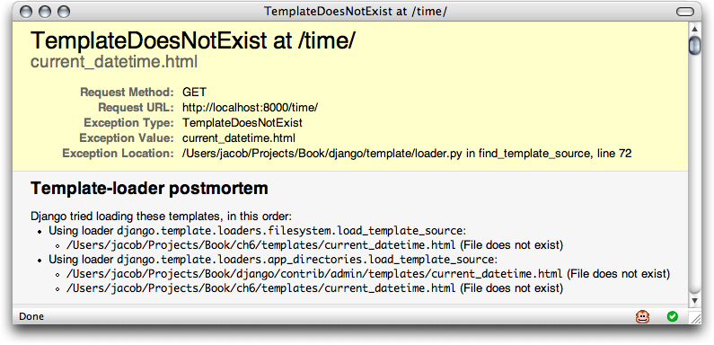

=====================================
Chapter 4: The Django Template System
=====================================

In the previous chapter, you may have noticed something peculiar in how we
returned the text in our example views. Namely, the HTML was hard-coded directly
in our Python code.

This arrangement leads to several problems:

    * Any change to the design of the page requires a change to
      the Python code. The design of a site tends to change far more frequently
      than the underlying Python code, so it would be convenient if the
      the design could change without needing to modify the Python code.

    * Writing Python code and designing HTML are two different disciplines, and
      most professional Web development environments split these
      responsibilities between separate people (or even separate departments).
      Designers and HTML/CSS coders shouldn't have to edit Python code to get
      their job done; they should deal with HTML.

    * Similarly, it's most efficient if programmers can work on Python code and
      designers can work on templates at the same time, rather than one person
      waiting for the other to finish editing a single file that contains both
      Python and HTML.

For these reasons, it's much cleaner and more maintainable to separate the
design of the page from the Python code itself. We can do this with Django's
*template system*, which we discuss in this chapter.

Template System Basics
======================

A Django template is a string of text that is intended to separate the
presentation of a document from its data. A template defines placeholders and
various bits of basic logic (i.e., template tags) that regulate how the document
should be displayed. Usually, templates are used for producing HTML, but Django
templates are equally capable of generating any text-based format.

Let's dive in with a simple example template. This template describes an HTML
page that thanks a person for placing an order with a company. Think of it as a
form letter::

    <html>
    <head><title>Ordering notice</title></head>

    <body>

    
Dear {{ person_name }},

    
Thanks for placing an order from {{ company }}. It's scheduled to
    ship on {{ ship_date|date:"F j, Y" }}.

    
Here are the items you've ordered:

    <ul>
    
    <li>{{ item }}</li>
    
    </ul>

    
    
Your warranty information will be included in the packaging.

    

    
Sincerely, {{ company }}

    </body>
    </html>

This template is basic HTML with some variables and template tags
thrown in. Let's step through it:

    * Any text surrounded by a pair of braces (e.g., ``{{ person_name }}``) is a
      *variable*. This means "insert the value of the variable with the given
      name." How do we specify the values of the variables? We'll get to that in
      a moment.

    * Any text that's surrounded by curly braces and percent signs (e.g., ````) is a *template tag*. The definition of a tag is
      quite broad: a tag just tells the template system to "do something."

      This example template contains two tags: the ```` tag (a ``for`` tag) and the ```` tag (an
      ``if`` tag).

      A ``for`` tag acts as a simple loop construct, letting you loop over each
      item in a sequence. An ``if`` tag, as you may expect, acts as a logical
      "if" statement. In this particular case, the tag checks whether the value
      of the ``ordered_warranty`` variable evaluates to ``True``. If it does,
      the template system will display everything between the ```` and ````. If not, the template system
      won't display it. The template system also supports ```` and
      other various logic statements.

    * Finally, the second paragraph of this template has an example of a
      *filter*, with which you can alter the display of a variable. In this
      example, ``{{ ship_date|date:"F j, Y" }}``, we're passing the
      ``ship_date`` variable to the ``date`` filter, giving the ``date`` filter
      the argument ``"F j, Y"``. The ``date`` filter formats dates in a given
      format, as specified by that argument. Filters are attached using a pipe
      character (``|``), as a reference to Unix pipes.

Each Django template has access to several built-in tags and filters, many of
which are discussed in the sections that follow. Appendix F contains the full
list of tags and filters, and it's a good idea to familiarize yourself with that
list so you know what's possible. It's also possible to create your own filters
and tags, which we cover in Chapter 10.

Using the Template System
=========================

To use the template system in Python code, just follow these two steps:

    1. Create a ``Template`` object by providing the raw template code as a
       string. Django also offers a way to create ``Template`` objects by
       designating the path to a template file on the filesystem; we'll examine
       that in a bit.

    2. Call the ``render()`` method of the ``Template`` object with a given
       set of variables (i.e., the context). This returns a fully rendered
       template as a string, with all of the variables and block tags evaluated
       according to the context.

The following sections describe each step in more detail.

Creating Template Objects
-------------------------

The easiest way to create a ``Template`` object is to instantiate it directly.
The ``Template`` class lives in the ``django.template`` module, and the
constructor takes one argument, the raw template code. Let's dip into the Python
interactive interpreter to see how this works in code.

.. admonition:: Interactive Interpreter Examples

    Throughout this book, we feature example Python interactive interpreter
    sessions. You can recognize these examples by the triple
    greater-than signs (``>>>``), which designate the interpreter's prompt. If
    you're copying examples from this book, don't copy those greater-than signs.

    Multiline statements in the interactive interpreter are padded with three
    dots (``...``), for example::

        >>> print """This is a
        ... string that spans
        ... three lines."""
        This is a
        string that spans
        three lines.
        >>> def my_function(value):
        ...     print value
        >>> my_function('hello')
        hello

    Those three dots at the start of the additional lines are inserted by the
    Python shell--they're not part of our input. We include them here to be
    faithful to the actual output of the interpreter. If you copy our examples
    to follow along, don't copy those dots.

From within the project directory created by ``django-admin.py startproject``
(as covered in Chapter 2), type ``python manage.py shell`` to start the
interactive interpreter. Here's a basic walk-through::

    >>> from django.template import Template
    >>> t = Template("My name is {{ name }}.")
    >>> print t

If you're following along interactively, you'll see something like this::

    <django.template.Template object at 0xb7d5f24c>

That ``0xb7d5f24c`` will be different every time, and it doesn't really matter;
it's simply the Python "identity" of the ``Template`` object.

.. admonition:: Django Settings

    When using Django, you need to tell Django which settings to use.
    Interactively, this is typically done using ``python manage.py shell``, but
    you've got a few other options described in Appendix E.

When you create a ``Template`` object, the template system compiles the raw
template code into an internal, optimized form, ready for rendering. But if your
template code includes any syntax errors, the call to ``Template()`` will cause
a ``TemplateSyntaxError`` exception::

    >>> from django.template import Template
    >>> t = Template(' ')
    Traceback (most recent call last):
      File "<stdin>", line 1, in ?
      ...
      django.template.TemplateSyntaxError: Invalid block tag: 'notatag'

The system raises a ``TemplateSyntaxError`` exception for any of the following
cases:

    * Invalid block tags
    * Invalid arguments to valid block tags
    * Invalid filters
    * Invalid arguments to valid filters
    * Invalid template syntax
    * Unclosed block tags (for block tags that require closing tags)

Rendering a Template
--------------------

Once you have a ``Template`` object, you can pass it data by giving it a
*context*. A context is simply a set of variables and their associated
values. A template uses this to populate its variable tags and evaluate its
block tags.

A context is represented in Django by the ``Context`` class, which lives in the
``django.template`` module. Its constructor takes one optional argument: a
dictionary mapping variable names to variable values. Call the ``Template``
object's ``render()`` method with the context to "fill" the template::

    >>> from django.template import Context, Template
    >>> t = Template("My name is {{ name }}.")
    >>> c = Context({"name": "Stephane"})
    >>> t.render(c)
    'My name is Stephane.'

.. admonition:: Dictionaries and Contexts

   A Python dictionary is a mapping between known keys and variable
   values. A ``Context`` is similar to a dictionary, but a ``Context``
   provides additional functionality, as covered in Chapter 10.

Variable names must begin with a letter (A-Z or a-z) and may contain digits,
underscores, and dots. (Dots are a special case we'll get to in a moment.)
Variable names are case sensitive.

Here's an example of template compilation and rendering, using the sample
template from the beginning of this chapter::

    >>> from django.template import Template, Context
    >>> raw_template = """
Dear {{ person_name }},

    ...
    ... 
Thanks for ordering {{ product }} from {{ company }}. It's scheduled
    ... to ship on {{ ship_date|date:"F j, Y" }}.

    ...
    ... 
    ... 
Your warranty information will be included in the packaging.

    ... 
    ...
    ... 
Sincerely, {{ company }}
"""
    >>> t = Template(raw_template)
    >>> import datetime
    >>> c = Context({'person_name': 'John Smith',
    ...     'product': 'Super Lawn Mower',
    ...     'company': 'Outdoor Equipment',
    ...     'ship_date': datetime.date(2009, 4, 2),
    ...     'ordered_warranty': True})
    >>> t.render(c)
    "
Dear John Smith,
\n\n
Thanks for ordering Super Lawn Mower from
    Outdoor Equipment. It's scheduled \nto ship on April 2, 2009.
\n\n\n
    
Your warranty information will be included in the packaging.
\n\n\n
    
Sincerely, Outdoor Equipment
"

Let's step through this code one statement at a time:

    * First, we import the classes ``Template`` and ``Context``, which both
      live in the module ``django.template``.

    * We save the raw text of our template into the variable
      ``raw_template``. Note that we use triple quote marks to designate the
      string, because it wraps over multiple lines; in Python codde, strings
      designated with single quote marks cannot be wrapped over multiple lines.

    * Next, we create a template object, ``t``, by passing ``raw_template`` to
      the ``Template`` class constructor.

    * We import the ``datetime`` module from Python's standard library,
      because we'll need it in the following statement.

    * Then, we create a ``Context`` object, ``c``. The ``Context``
      constructor takes a Python dictionary, which maps variable names to
      values. Here, for example, we specify that the ``person_name``
      is ``'John Smith'``, ``product`` is ``'Super Lawn Mower'``, and so forth.

    * Finally, we call the ``render()`` method on our template object, passing
      it the context. This returns the rendered template--that is, it
      replaces template variables with the actual values of the variables, and
      it executes any block tags.

      Note that the warranty paragraph was displayed because the
      ``ordered_warranty`` variable evaluated to ``True``. Also note the
      date, ``April 2, 2009``, which is displayed according to the format
      string ``'F j, Y'``. (We explain format strings for the ``date``
      filter shortly.)

      If you're new to Python, you may wonder why this output includes
      newline characters (``'\n'``) rather than displaying the line breaks.
      That's happening because of a subtlety in the Python interactive
      interpreter: the call to ``t.render(c)`` returns a string, and by default
      the interactive interpreter displays the *representation* of the string,
      rather than the printed value of the string. If you want to see the
      string with line breaks displayed as true line breaks rather than ``'\n'``
      characters, use the ``print`` statement: ``print t.render(c)``.

Those are the fundamentals of using the Django template system: just write a
template, create a ``Template`` object, create a ``Context``, and call
the ``render()`` method.

Multiple Contexts, Same Template
--------------------------------

Once you have a ``Template`` object, you can render multiple contexts through
it, for example::

    >>> from django.template import Template, Context
    >>> t = Template('Hello, {{ name }}')
    >>> print t.render(Context({'name': 'John'}))
    Hello, John
    >>> print t.render(Context({'name': 'Julie'}))
    Hello, Julie
    >>> print t.render(Context({'name': 'Pat'}))
    Hello, Pat

Whenever you're using the same template source to render multiple
contexts like this, it's more efficient to create the ``Template``
object *once*, and then call ``render()`` on it multiple times::

    # Bad
    for name in ('John', 'Julie', 'Pat'):
        t = Template('Hello, {{ name }}')
        print t.render(Context({'name': name}))

    # Good
    t = Template('Hello, {{ name }}')
    for name in ('John', 'Julie', 'Pat'):
        print t.render(Context({'name': name}))

Django's template parsing is quite fast. Behind the scenes, most of the parsing
happens via a single call to a short regular expression. This is in stark
contrast to XML-based template engines, which incur the overhead of an XML
parser and tend to be orders of magnitude slower than Django's template
rendering engine.

Context Variable Lookup
-----------------------

In the examples so far, we've passed simple values in the contexts--mostly
strings, plus a ``datetime.date`` example. However, the template system
elegantly handles more complex data structures, such as lists, dictionaries, and
custom objects.

The key to traversing complex data structures in Django templates is the dot
character (``.``). Use a dot to access dictionary keys, attributes, indices, or
methods of an object.

This is best illustrated with a few examples. For instance, suppose
you're passing a Python dictionary to a template. To access the values
of that dictionary by dictionary key, use a dot::

    >>> from django.template import Template, Context
    >>> person = {'name': 'Sally', 'age': '43'}
    >>> t = Template('{{ person.name }} is {{ person.age }} years old.')
    >>> c = Context({'person': person})
    >>> t.render(c)
    'Sally is 43 years old.'

Similarly, dots also allow access of object attributes. For example, a Python
``datetime.date`` object has ``year``, ``month``, and ``day`` attributes, and
you can use a dot to access those attributes in a Django template::

    >>> from django.template import Template, Context
    >>> import datetime
    >>> d = datetime.date(1993, 5, 2)
    >>> d.year
    1993
    >>> d.month
    5
    >>> d.day
    2
    >>> t = Template('The month is {{ date.month }} and the year is {{ date.year }}.')
    >>> c = Context({'date': d})
    >>> t.render(c)
    'The month is 5 and the year is 1993.'

This example uses a custom class::

    >>> from django.template import Template, Context
    >>> class Person(object):
    ...     def __init__(self, first_name, last_name):
    ...         self.first_name, self.last_name = first_name, last_name
    >>> t = Template('Hello, {{ person.first_name }} {{ person.last_name }}.')
    >>> c = Context({'person': Person('John', 'Smith')})
    >>> t.render(c)
    'Hello, John Smith.'

Dots are also used to call methods on objects. For example, each
Python string has the methods ``upper()`` and ``isdigit()``, and you can call
those in Django templates using the same dot syntax::

    >>> from django.template import Template, Context
    >>> t = Template('{{ var }} -- {{ var.upper }} -- {{ var.isdigit }}')
    >>> t.render(Context({'var': 'hello'}))
    'hello -- HELLO -- False'
    >>> t.render(Context({'var': '123'}))
    '123 -- 123 -- True'

Note that you don't include parentheses in the method calls. Also, it's not
possible to pass arguments to the methods; you can only call methods that have
no required arguments. (We explain this philosophy later in this chapter.)

Finally, dots are also used to access list indices, for example::

    >>> from django.template import Template, Context
    >>> t = Template('Item 2 is {{ items.2 }}.')
    >>> c = Context({'items': ['apples', 'bananas', 'carrots']})
    >>> t.render(c)
    'Item 2 is carrots.'

Negative list indices are not allowed. For example, the template variable
``{{ items.-1 }}`` would cause a ``TemplateSyntaxError``.

.. admonition:: Python Lists

   Python lists have 0-based indices so that the first item is at
   index 0, the second is at index 1, and so on.

The dot lookups can be summarized like this: when the template system
encounters a dot in a variable name, it tries the following lookups, in this
order:

    * Dictionary lookup (e.e., ``foo["bar"]``)
    * Attribute lookup (e.g., ``foo.bar``)
    * Method call (e.g., ``foo.bar()``)
    * List-index lookup (e.g., ``foo[bar]``)

The system uses the first lookup type that works. It's short-circuit logic.

Dot lookups can be nested multiple levels deep. For instance, the following
example uses ``{{ person.name.upper }}``, which translates into a dictionary
lookup (``person['name']``) and then a method call (``upper()``)::

    >>> from django.template import Template, Context
    >>> person = {'name': 'Sally', 'age': '43'}
    >>> t = Template('{{ person.name.upper }} is {{ person.age }} years old.')
    >>> c = Context({'person': person})
    >>> t.render(c)
    'SALLY is 43 years old.'

Method Call Behavior
~~~~~~~~~~~~~~~~~~~~

Method calls are slightly more complex than the other lookup types. Here are
some things to keep in mind:

    * If, during the method lookup, a method raises an exception, the exception
      will be propagated, unless the exception has an attribute
      ``silent_variable_failure`` whose value is ``True``. If the exception
      *does* have a ``silent_variable_failure`` attribute, the variable will
      render as an empty string, for example::

            >>> t = Template("My name is {{ person.first_name }}.")
            >>> class PersonClass3:
            ...     def first_name(self):
            ...         raise AssertionError, "foo"
            >>> p = PersonClass3()
            >>> t.render(Context({"person": p}))
            Traceback (most recent call last):
            ...
            AssertionError: foo

            >>> class SilentAssertionError(AssertionError):
            ...     silent_variable_failure = True
            >>> class PersonClass4:
            ...     def first_name(self):
            ...         raise SilentAssertionError
            >>> p = PersonClass4()
            >>> t.render(Context({"person": p}))
            "My name is ."

    * A method call will only work if the method has no required arguments.
      Otherwise, the system will move to the next lookup type (list-index
      lookup).

    * Obviously, some methods have side effects, and it would be foolish at
      best, and possibly even a security hole, to allow the template system to
      access them.

      Say, for instance, you have a ``BankAccount`` object that has a
      ``delete()`` method. A template shouldn't be allowed to include
      something like ``{{ account.delete }}``.

      To prevent this, set the function attribute ``alters_data`` on the
      method::

          def delete(self):
              # Delete the account
          delete.alters_data = True

      The template system won't execute any method marked in this way. In other
      words, if a template includes ``{{ account.delete }}``, that tag will not
      execute the ``delete()`` method. It will fail silently.

How Invalid Variables Are Handled
~~~~~~~~~~~~~~~~~~~~~~~~~~~~~~~~~

By default, if a variable doesn't exist, the template system renders it as an
empty string, failing silently, for example::

    >>> from django.template import Template, Context
    >>> t = Template('Your name is {{ name }}.')
    >>> t.render(Context())
    'Your name is .'
    >>> t.render(Context({'var': 'hello'}))
    'Your name is .'
    >>> t.render(Context({'NAME': 'hello'}))
    'Your name is .'
    >>> t.render(Context({'Name': 'hello'}))
    'Your name is .'

The system fails silently rather than raising an exception because it's
intended to be resilient to human error. In this case, all of the
lookups failed because variable names have the wrong case or name. In the real
world, it's unacceptable for a Web site to become inaccessible due to a
small template syntax error.

Note that it's possible to change Django's default behavior in this regard, by
tweaking a setting in your Django configuration. We discuss this further in
Chapter 10.

Playing with Context Objects
----------------------------

Most of the time, you'll instantiate ``Context`` objects by passing in a
fully populated dictionary to ``Context()``. But you can add and delete items
from a ``Context`` object once it's been instantiated, too, using standard
Python dictionary syntax::

    >>> from django.template import Context
    >>> c = Context({"foo": "bar"})
    >>> c['foo']
    'bar'
    >>> del c['foo']
    >>> c['foo']
    ''
    >>> c['newvariable'] = 'hello'
    >>> c['newvariable']
    'hello'

Basic Template Tags and Filters
===============================

As we've mentioned already, the template system ships with built-in tags and
filters. The sections that follow provide a rundown of the most common tags and
filters.

Tags
----

if/else
~~~~~~~

The ```` tag evaluates a variable, and if that variable is "true"
(i.e., it exists, is not empty, and is not a false Boolean value), the system
will display everything between ```` and ````, for example::

    
        
Welcome to the weekend!

    

An ```` tag is optional::

    
        
Welcome to the weekend!

    
        
Get back to work.

    

.. admonition:: Python "Truthiness"

   In Python, the empty list (``[]``), tuple (``()``), dictionary
   (``{}``), string (``''``), zero (``0``), and the special object ``None`` are
   ``False`` in a Boolean context.  Everything else is ``True``.

The ```` tag accepts ``and``, ``or``, or ``not`` for testing multiple
variables, or to negate a given variable. For example::

    
        Both athletes and coaches are available.
    

    
        There are no athletes.
    

    
        There are some athletes or some coaches.
    

    
        There are no athletes or there are some coaches. (OK, so
        writing English translations of Boolean logic sounds
        stupid; it's not our fault.)
    

    
        There are some athletes and absolutely no coaches.
    

```` tags don't allow ``and`` and ``or`` clauses within the same tag,
because the order of logic would be ambiguous. For example, this is invalid::

    

The use of parentheses for controlling order of operations is not supported. If
you find yourself needing parentheses, consider performing logic in the
view code in order to simplify the templates. Even so, if you need to combine
``and`` and ``or`` to do advanced logic, just use nested ````
tags, for example::

    
        
            We have athletes, and either coaches or cheerleaders!
        
    

Multiple uses of the same logical operator are fine, but you can't
combine different operators. For example, this is valid::

    

There is no ```` tag. Use nested ```` tags to accomplish
the same thing::

    
        
Here are the athletes: {{ athlete_list }}.

    
        
No athletes are available.

        
            
Here are the coaches: {{ coach_list }}.

        
    

Make sure to close each ```` with an ````. Otherwise, Django
will throw a ``TemplateSyntaxError``.

for
~~~

The ```` tag allows you to loop over each item in a sequence. As in
Python's ``for`` statement, the syntax is ``for X in Y``, where ``Y`` is the
sequence to loop over and ``X`` is the name of the variable to use for a
particular cycle of the loop. Each time through the loop, the template system
will render everything between ```` and ````.

For example, you could use the following to display a list of athletes given a
variable ``athlete_list``::

    <ul>
    
        <li>{{ athlete.name }}</li>
    
    </ul>

Add ``reversed`` to the tag to loop over the list in reverse::

    
    ...
    

It's possible to nest ```` tags::

    
        <h1>{{ country.name }}</h1>
        <ul>
        
            <li>{{ city }}</li>
        
        </ul>
    

There is no support for "breaking out" of a loop before the loop is finished.
If you want to accomplish this, change the variable you're looping over so that
it includes only the values you want to loop over. Similarly, there is no
support for a "continue" statement that would instruct the loop processor to
return immediately to the front of the loop. (See the section "Philosophies and
Limitations" later in this chapter for the reasoning behind this design
decision.)

The ```` tag sets a magic ``forloop`` template variable within the
loop. This variable has a few attributes that give you information about the
progress of the loop:

    * ``forloop.counter`` is always set to an integer representing the number
      of times the loop has been entered. This is one-indexed, so the first
      time through the loop, ``forloop.counter`` will be set to ``1``.
      Here's an example::

          
              
{{ forloop.counter }}: {{ item }}

          

    * ``forloop.counter0`` is like ``forloop.counter``, except it's
      zero-indexed. Its value will be set to ``0`` the first time through the
      loop.

    * ``forloop.revcounter`` is always set to an integer representing the
      number of remaining items in the loop. The first time through the loop,
      ``forloop.revcounter`` will be set to the total number of items in the
      sequence you're traversing. The last time through the loop,
      ``forloop.revcounter`` will be set to ``1``.

    * ``forloop.revcounter0`` is like ``forloop.revcounter``, except it's
      zero-indexed. The first time through the loop, ``forloop.revcounter0``
      will be set to the number of elements in the sequence minus 1. The last
      time through the loop, it will be set to ``0``.

    * ``forloop.first`` is a Boolean value set to ``True`` if this is the first
      time through the loop. This is convenient for special casing::

          
              <li class="first"><li>
              {{ object }}
              </li>
          

    * ``forloop.last`` is a Boolean value set to ``True`` if this is the last
      time through the loop. A common use for this is to put pipe
      characters between a list of links::

          {{ link }} | 

	  The above template code might output something like this::

		  Link1 | Link2 | Link3 | Link4

    * ``forloop.parentloop`` is a reference to the ``forloop`` object for the
      *parent* loop, in case of nested loops. Here's an example::

          
              <table>
              
                  <tr>
                  <td>Country #{{ forloop.parentloop.counter }}</td>
                  <td>City #{{ forloop.counter }}</td>
                  <td>{{ city }}</td>
                  </tr>
              
              </table>
          

The magic ``forloop`` variable is only available within loops. After the
template parser has reached ````, ``forloop`` disappears.

.. admonition:: Context and the forloop Variable

   Inside the ```` block, the existing variables are moved
   out of the way to avoid overwriting the magic ``forloop``
   variable. Django exposes this moved context in
   ``forloop.parentloop``. You generally don't need to worry about
   this, but if you supply a template variable named ``forloop``
   (though we advise against it), it will be named
   ``forloop.parentloop`` while inside the ```` block.

ifequal/ifnotequal
~~~~~~~~~~~~~~~~~~

The Django template system deliberately is not a full-fledged programming
language and thus does not allow you to execute arbitrary Python statements.
(More on this idea in the section "Philosophies and Limitations.") However, it's
quite a common template requirement to compare two values and display something
if they're equal--and Django provides an ```` tag for that purpose.

The ```` tag compares two values and displays everything between
```` and ```` if the values are equal.

This example compares the template variables ``user`` and ``currentuser``::

    
        <h1>Welcome!</h1>
    

The arguments can be hard-coded strings, with either single or double quotes,
so the following is valid::

    
        <h1>Site News</h1>
    

    
        <h1>Community</h1>
    

Just like ````, the ```` tag supports an optional
````::

    
        <h1>Site News</h1>
    
        <h1>No News Here</h1>
    

Only template variables, strings, integers, and decimal numbers are allowed as
arguments to ````. These are valid examples::

    
    
    
    

Any other types of variables, such as Python dictionaries, lists, or Booleans,
can't be hard-coded in ````. These are invalid examples::

    
    
    

If you need to test whether something is true or false, use the ````
tags instead of ````.

Comments
~~~~~~~~

Just as in HTML or in a programming language such as Python, the Django
template language allows for comments. To designate a comment, use ``{# #}``::

    {# This is a comment #}

The comment will not be output when the template is rendered.

A comment cannot span multiple lines. This limitation improves template
parsing performance. In the following template, the rendered output
will look exactly the same as the template (i.e., the comment tag will
not be parsed as a comment)::

    This is a {# this is not
    a comment #}
    test.

Filters
-------

As explained earlier in this chapter, template filters are simple ways of
altering the value of variables before they're displayed. Filters look like
this::

    {{ name|lower }}

This displays the value of the ``{{ name }}`` variable after being filtered
through the ``lower`` filter, which converts text to lowercase. Use a pipe
(``|``) to apply a filter.

Filters can be *chained*--that is, the output of one filter is applied to the
next. Here's a common idiom for escaping text contents, and then converting line
breaks to ``
`` tags::

    {{ my_text|escape|linebreaks }}

Some filters take arguments. A filter argument looks like this::

    {{ bio|truncatewords:"30" }}

This displays the first 30 words of the ``bio`` variable. Filter arguments
are always in double quotes.

The following are a few of the most important filters; Appendix F covers the rest.

    * ``addslashes``: Adds a backslash before any backslash, single quote, or
      double quote. This is useful if the produced text is included in
      a JavaScript string.

    * ``date``: Formats a ``date`` or ``datetime`` object according to a
      format string given in the parameter, for example::

          {{ pub_date|date:"F j, Y" }}

      Format strings are defined in Appendix F.

    * ``escape``: Escapes ampersands, quotes, and angle brackets in the given
      string. This is useful for sanitizing user-submitted data and for
      ensuring data is valid XML or XHTML. Specifically, ``escape`` makes these
      conversions:

          * Converts ``&`` to ``&amp;``
          * Converts ``<`` to ``&lt;``
          * Converts ``>`` to ``&gt;``
          * Converts ``"`` (double quote) to ``&quot;``
          * Converts ``'`` (single quote) to ``&#39;``

    * ``length``: Returns the length of the value. You can use this on a list
      or a string, or any Python object that knows how to determine its length
      (i.e., any object that has a ``__len__()`` method).

Philosophies and Limitations
============================

Now that you've gotten a feel for the Django template language, we should point
out some of its intentional limitations, along with some philosophies behind why
it works the way it works.

More than any other component of Web applications, programmer opinions on
template systems vary wildly. The fact that Python alone has dozens, if not
hundreds, of open source template-language implementations supports this point.
Each was likely created because its developer deemed all existing template
languages inadequate. (In fact, it is said to be a rite of passage for a Python
developer to write his or her own template language! If you haven't done this
yet, consider it. It's a fun exercise.)

With that in mind, you might be interested to know that Django doesn't require
that you use its template language. Because Django is intended to be a
full-stack Web framework that provides all the pieces necessary for Web
developers to be productive, many times it's *more convenient* to use Django's
template system than other Python template libraries, but it's not a strict
requirement in any sense. As you'll see in the upcoming section "Using Templates
in Views", it's very easy to use another template language with Django.

Still, it's clear we have a strong preference for the way Django's template
language works. The template system has roots in how Web development is done at
World Online and the combined experience of Django's creators. Here are a few of
those philosophies:

    * *Business logic should be separated from presentation logic*. We see a
      template system as a tool that controls presentation and
      presentation-related logic--and that's it. The template system shouldn't
      support functionality that goes beyond this basic goal.

      For that reason, it's impossible to call Python code directly within
      Django templates. All "programming" is fundamentally limited to the scope
      of what template tags can do. It *is* possible to write custom template
      tags that do arbitrary things, but the out-of-the-box Django template
      tags intentionally do not allow for arbitrary Python code execution.

    * *Syntax should be decoupled from HTML/XML*. Although Django's template
      system is used primarily to produce HTML, it's intended to be just as
      usable for non-HTML formats, such as plain text. Some other template
      languages are XML based, placing all template logic within XML tags or
      attributes, but Django deliberately avoids this limitation. Requiring
      valid XML to write templates introduces a world of human mistakes and
      hard-to-understand error messages, and using an XML engine to parse
      templates incurs an unacceptable level of overhead in template processing.

    * *Designers are assumed to be comfortable with HTML code*. The template
      system isn't designed so that templates necessarily are displayed nicely
      in WYSIWYG editors such as Dreamweaver. That is too severe a limitation
      and wouldn't allow the syntax to be as nice as it is. Django expects
      template authors to be comfortable editing HTML directly.

    * *Designers are assumed not to be Python programmers*. The template system
      authors recognize that Web page templates are most often written by
      *designers*, not *programmers*, and therefore should not assume Python
      knowledge.

      However, the system also intends to accommodate small teams in which the
      templates *are* created by Python programmers. It offers a way to extend
      the system's syntax by writing raw Python code. (More on this in Chapter
      10.)

    * *The goal is not to invent a programming language*. The goal is to offer
      just enough programming-esque functionality, such as branching and
      looping, that is essential for making presentation-related decisions.

As a result of these design philosophies, the Django template language has the
following limitations:

    * *A template cannot set a variable or change the value of a variable*. It's
      possible to write custom template tags that accomplish these goals (see
      Chapter 10), but the stock Django template tags do not allow it.

    * *A template cannot call raw Python code*. There's no way to "drop into
      Python mode" or use raw Python constructs. Again, it's possible to write
      custom template tags to do this, but the stock Django template tags don't
      allow it.

Using Templates in Views
========================

You've learned the basics of using the template system; now let's use this
knowledge to create a view. Recall the ``current_datetime`` view in
``mysite.views``, which we started in the previous chapter. Here's what it looks
like::

    from django.http import HttpResponse
    import datetime

    def current_datetime(request):
        now = datetime.datetime.now()
        html = "<html><body>It is now %s.</body></html>" % now
        return HttpResponse(html)

Let's change this view to use Django's template system. At first, you might
think to do something like this::

    from django.template import Template, Context
    from django.http import HttpResponse
    import datetime

    def current_datetime(request):
        now = datetime.datetime.now()
        t = Template("<html><body>It is now {{ current_date }}.</body></html>")
        html = t.render(Context({'current_date': now}))
        return HttpResponse(html)

Sure, that uses the template system, but it doesn't solve the problems we
pointed out in the introduction of this chapter. Namely, the template is still
embedded in the Python code. Let's fix that by putting the template in a
*separate file*, which this view will load.

You might first consider saving your template somewhere on your
filesystem and using Python's built-in file-opening functionality to read
the contents of the template. Here's what that might look like, assuming the
template was saved as the file ``/home/djangouser/templates/mytemplate.html``::

    from django.template import Template, Context
    from django.http import HttpResponse
    import datetime

    def current_datetime(request):
        now = datetime.datetime.now()
        # Simple way of using templates from the filesystem.
        # This doesn't account for missing files!
        fp = open('/home/djangouser/templates/mytemplate.html')
        t = Template(fp.read())
        fp.close()
        html = t.render(Context({'current_date': now}))
        return HttpResponse(html)

This approach, however, is inelegant for these reasons:

    * It doesn't handle the case of a missing file. If the file
      ``mytemplate.html`` doesn't exist or isn't readable, the ``open()`` call
      will raise an ``IOError`` exception.

    * It hard-codes your template location. If you were to use this
      technique for every view function, you'd be duplicating the template
      locations. Not to mention it involves a lot of typing!

    * It includes a lot of boring boilerplate code. You've got better things to
      do than to write calls to ``open()``, ``fp.read()``, and ``fp.close()``
      each time you load a template.

To solve these issues, we'll use *template loading* and *template directories*,
both of which are described in the sections that follow.

Template Loading
================

Django provides a convenient and powerful API for loading templates from disk,
with the goal of removing redundancy both in your template-loading calls and in
your templates themselves.

In order to use this template-loading API, first you'll need to tell the
framework where you store your templates. The place to do this is in your
*settings file*.

A Django settings file is the place to put configuration for your Django
instance (aka your Django project). It's a simple Python module with
module-level variables, one for each setting.

When you ran ``django-admin.py startproject mysite`` in Chapter 2, the script
created a default settings file for you, aptly named ``settings.py``. Have a
look at the file's contents. It contains variables that look like this (though
not necessarily in this order)::

    DEBUG = True
    TIME_ZONE = 'America/Chicago'
    USE_I18N = True
    ROOT_URLCONF = 'mysite.urls'

This is pretty self-explanatory; the settings and their respective values are
simple Python variables. And because the settings file is just a plain Python
module, you can do dynamic things such as checking the value of one variable
before setting another. (This also means that you should avoid Python syntax
errors in your settings file.)

We'll cover settings files in depth in Appendix E, but for now, have a look at
the ``TEMPLATE_DIRS`` setting. This setting tells Django's template-loading
mechanism where to look for templates. By default, it's an empty tuple. Pick a
directory where you'd like to store your templates and add it to
``TEMPLATE_DIRS``, like so::

    TEMPLATE_DIRS = (
        '/home/django/mysite/templates',
    )

There are a few things to note:

    * You can specify any directory you want, as long as the directory and
      templates within that directory are readable by the user account under
      which your Web server runs. If you can't think of an appropriate
      place to put your templates, we recommend creating a
      ``templates`` directory within your Django project (i.e., within
      the ``mysite`` directory you created in Chapter 2, if you've
      been following along with this book's examples).

    * Don't forget the comma at the end of the template directory string!
      Python requires commas within single-element tuples to disambiguate the
      tuple from a parenthetical expression. This is a common newbie gotcha.

      If you want to avoid this error, you can make ``TEMPLATE_DIRS`` a list
      instead of a tuple, because single-element lists don't require a trailing
      comma::

          TEMPLATE_DIRS = [
              '/home/django/mysite/templates'
          ]

      A tuple is slightly more semantically correct than a list (tuples cannot
      be changed after being created, and nothing should be changing settings
      once they've been read), so we recommend using a tuple for your
      ``TEMPLATE_DIRS`` setting.

    * If you're on Windows, include your drive letter and use Unix-style
      forward slashes rather than backslashes, as follows::

          TEMPLATE_DIRS = (
              'C:/www/django/templates',
          )

    * It's simplest to use absolute paths (i.e., directory paths that start at
      the root of the filesystem). If you want to be a bit more flexible and
      decoupled, though, you can take advantage of the fact that Django
      settings files are just Python code by constructing the contents of
      ``TEMPLATE_DIRS`` dynamically, for example::

          import os.path

          TEMPLATE_DIRS = (
              os.path.join(os.path.dirname(__file__), 'templates').replace('\\','/'),
          )

      This example uses the "magic" Python variable ``__file__``, which is
      automatically set to the file name of the Python module in which the code
      lives.

With ``TEMPLATE_DIRS`` set, the next step is to change the view code to
use Django's template-loading functionality rather than hard-coding the
template paths. Returning to our ``current_datetime`` view, let's change it
like so::

    from django.template.loader import get_template
    from django.template import Context
    from django.http import HttpResponse
    import datetime

    def current_datetime(request):
        now = datetime.datetime.now()
        t = get_template('current_datetime.html')
        html = t.render(Context({'current_date': now}))
        return HttpResponse(html)

In this example, we're using the function
``django.template.loader.get_template()`` rather than loading the template from
the filesystem manually. The ``get_template()`` function takes a template name
as its argument, figures out where the template lives on the filesystem, opens
that file, and returns a compiled ``Template`` object.

If ``get_template()`` cannot find the template with the given name, it raises
a ``TemplateDoesNotExist`` exception. To see what that looks like, fire up the
Django development server again, as in Chapter 3, by running
``python manage.py runserver`` within your Django project's directory. Then,
point your browser at the page that activates the ``current_datetime`` view
(e.g., ``http://127.0.0.1:8000/time/``). Assuming your ``DEBUG`` setting is set
to ``True`` and you haven't yet created a ``current_datetime.html`` template,
you should see a Django error page highlighting the ``TemplateDoesNotExist``
error.

   Figure 4-1: The error page shown when a template cannot be found.

This error page is similar to the one we explained in Chapter 3, with one
additional piece of debugging information: a "Template-loader postmortem"
section. This section tells you which templates Django tried to load, along with
the reason each attempt failed (e.g., "File does not exist"). This information
is invaluable when you're trying to debug template-loading errors.

As you can probably tell from the error messages found in the Figure 4-1, Django
attempted to find the template by combining the directory in the
``TEMPLATE_DIRS`` setting with the template name passed to ``get_template()``.
So if your ``TEMPLATE_DIRS`` contains ``'/home/django/templates'``, Django looks
for the file ``'/home/django/templates/current_datetime.html'``. If
``TEMPLATE_DIRS`` contains more than one directory, each is checked until the
template is found or they've all been checked.

Moving along, create the ``current_datetime.html`` file within your template
directory using the following template code::

    <html><body>It is now {{ current_date }}.</body></html>

Refresh the page in your Web browser, and you should see the fully rendered
page.

render_to_response()
--------------------

Because it's such a common idiom to load a template, fill a ``Context``, and
return an ``HttpResponse`` object with the result of the rendered template,
Django provides a shortcut that lets you do those things in one line of code.
This shortcut is a function called ``render_to_response()``, which lives in the
module ``django.shortcuts``. Most of the time, you'll be using
``render_to_response()`` rather than loading templates and creating ``Context``
and ``HttpResponse`` objects manually.

Here's the ongoing ``current_datetime`` example rewritten to use
``render_to_response()``::

    from django.shortcuts import render_to_response
    import datetime

    def current_datetime(request):
        now = datetime.datetime.now()
        return render_to_response('current_datetime.html', {'current_date': now})

What a difference! Let's step through the code changes:

    * We no longer have to import ``get_template``, ``Template``, ``Context``,
      or ``HttpResponse``. Instead, we import
      ``django.shortcuts.render_to_response``. The ``import datetime`` remains.

    * Within the ``current_datetime`` function, we still calculate ``now``, but
      the template loading, context creation, template rendering, and
      ``HttpResponse`` creation is all taken care of by the
      ``render_to_response()`` call. Because ``render_to_response()`` returns
      an ``HttpResponse`` object, we can simply ``return`` that value in the
      view.

The first argument to ``render_to_response()`` should be the name of the
template to use. The second argument, if given, should be a dictionary
to use in creating a ``Context`` for that template. If you don't
provide a second argument, ``render_to_response()`` will use an empty dictionary.

Subdirectories in get_template()
--------------------------------

It can get unwieldy to store all of your templates in a single directory. You
might like to store templates in subdirectories of your template directory, and
that's fine. In fact, we recommend doing so; some more advanced Django
features (such as the generic views system, which we cover in
Chapter 9) expect this template layout as a default convention.

Storing templates in subdirectories of your template directory is easy.
In your calls to ``get_template()``, just include
the subdirectory name and a slash before the template name, like so::

    t = get_template('dateapp/current_datetime.html')

Because ``render_to_response()`` is a small wrapper around ``get_template()``,
you can do the same thing with the first argument to ``render_to_response()``.

There's no limit to the depth of your subdirectory tree. Feel free to use
as many as you like.

.. note::

    Windows users, be sure to use forward slashes rather than backslashes.
    ``get_template()`` assumes a Unix-style file name designation.

The ``include`` Template Tag
----------------------------

Now that we've covered the template-loading mechanism, we can introduce a
built-in template tag that takes advantage of it: ````. This tag
allows you to include the contents of another template. The argument to the tag
should be the name of the template to include, and the template name can be
either a variable or a hard-coded (quoted) string, in either single or double
quotes. Anytime you have the same code in multiple templates,
consider using an ```` to remove the duplication.

These two examples include the contents of the template ``nav.html``. The
examples are equivalent and illustrate that either single or double quotes
are allowed::

    
    

This example includes the contents of the template ``includes/nav.html``::

    

This example includes the contents of the template whose name is contained in
the variable ``template_name``::

    

As in ``get_template()``, the file name of the template is determined by adding
the template directory from ``TEMPLATE_DIRS`` to the requested template name.

Included templates are evaluated with the context of the template
that's including them.

If a template with the given name isn't found, Django will do one of two
things:

    * If ``DEBUG`` is set to ``True``, you'll see the
      ``TemplateDoesNotExist`` exception on a Django error page.

    * If ``DEBUG`` is set to ``False``, the tag will fail
      silently, displaying nothing in the place of the tag.

Template Inheritance
====================

Our template examples so far have been tiny HTML snippets, but in the real
world, you'll be using Django's template system to create entire HTML pages.
This leads to a common Web development problem: across a Web site, how does
one reduce the duplication and redundancy of common page areas, such as
sitewide navigation?

A classic way of solving this problem is to use *server-side includes*,
directives you can embed within your HTML pages to "include" one Web page
inside another. Indeed, Django supports that approach, with the
```` template tag just described. But the preferred way of
solving this problem with Django is to use a more elegant strategy called
*template inheritance*.

In essence, template inheritance lets you build a base "skeleton" template that
contains all the common parts of your site and defines "blocks" that child
templates can override.

Let's see an example of this by creating a more complete template for our
``current_datetime`` view, by editing the ``current_datetime.html`` file::

    <!DOCTYPE HTML PUBLIC "-//W3C//DTD HTML 4.01//EN">
    <html lang="en">
    <head>
        <title>The current time</title>
    </head>
    <body>
        <h1>My helpful timestamp site</h1>
        
It is now {{ current_date }}.

        

        
Thanks for visiting my site.

    </body>
    </html>

That looks just fine, but what happens when we want to create a template for
another view--say, the ``hours_ahead`` view from Chapter 3? If we want again
to make a nice, valid, full HTML template, we'd create something like::

    <!DOCTYPE HTML PUBLIC "-//W3C//DTD HTML 4.01//EN">
    <html lang="en">
    <head>
        <title>Future time</title>
    </head>
    <body>
        <h1>My helpful timestamp site</h1>
        
In {{ hour_offset }} hour(s), it will be {{ next_time }}.

        

        
Thanks for visiting my site.

    </body>
    </html>

Clearly, we've just duplicated a lot of HTML. Imagine if we had a more
typical site, including a navigation bar, a few style sheets, perhaps some
JavaScript--we'd end up putting all sorts of redundant HTML into each
template.

The server-side include solution to this problem is to factor out the
common bits in both templates and save them in separate template snippets,
which are then included in each template. Perhaps you'd store the top
bit of the template in a file called ``header.html``::

    <!DOCTYPE HTML PUBLIC "-//W3C//DTD HTML 4.01//EN">
    <html lang="en">
    <head>

And perhaps you'd store the bottom bit in a file called ``footer.html``::

        

        
Thanks for visiting my site.

    </body>
    </html>

With an include-based strategy, headers and footers are easy. It's the
middle ground that's messy. In this example, both pages feature a title--
``<h1>My helpful timestamp site</h1>``--but that title can't fit into
``header.html`` because the ``<title>`` on both pages is different. If we
included the ``<h1>`` in the header, we'd have to include the ``<title>``,
which wouldn't allow us to customize it per page. See where this is going?

Django's template inheritance system solves these problems. You can think of it
as an "inside-out" version of server-side includes. Instead of defining the
snippets that are *common*, you define the snippets that are *different*.

The first step is to define a *base template*--a skeleton of your page that
*child templates* will later fill in. Here's a base template for our ongoing
example::

    <!DOCTYPE HTML PUBLIC "-//W3C//DTD HTML 4.01//EN">
    <html lang="en">
    <head>
        <title></title>
    </head>
    <body>
        <h1>My helpful timestamp site</h1>
        
        
        

        
Thanks for visiting my site.

        
    </body>
    </html>

This template, which we'll call ``base.html``, defines a simple HTML skeleton
document that we'll use for all the pages on the site. It's the job of child
templates to override, or add to, or leave alone the contents of the blocks.
(If you're following along at home, save this file to your template directory.)

We're using a template tag here that you haven't seen before: the
```` tag. All the ```` tags do is tell the template
engine that a child template may override those portions of the template.

Now that we have this base template, we can modify our existing
``current_datetime.html`` template to use it::

    

    The current time

    
    
It is now {{ current_date }}.

    

While we're at it, let's create a template for the ``hours_ahead`` view from
Chapter 3. (If you're following along with code, we'll leave it up to you to
change ``hours_ahead`` to use the template system.) Here's what that would
look like::

    

    Future time

    
    
In {{ hour_offset }} hour(s), it will be {{ next_time }}.

    

Isn't this beautiful? Each template contains only the code that's *unique* to
that template. No redundancy needed. If you need to make a site-wide design
change, just make the change to ``base.html``, and all of the other templates
will immediately reflect the change.

Here's how it works. When you load the template ``current_datetime.html``,
the template engine sees the ```` tag, noting that
this template is a child template. The engine immediately loads the
parent template--in this case, ``base.html``.

At that point, the template engine notices the three ```` tags
in ``base.html`` and replaces those blocks with the contents of the child
template. So, the title we've defined in ```` will be
used, as will the ````.

Note that since the child template doesn't define the ``footer`` block,
the template system uses the value from the parent template instead.
Content within a ```` tag in a parent template is always
used as a fallback.

Inheritance doesn't affect the way the context works, and you can use
as many levels of inheritance as needed. One common way of using inheritance
is the following three-level approach:

    1. Create a ``base.html`` template that holds the main look and feel of
       your site. This is the stuff that rarely, if ever, changes.

    2. Create a ``base_SECTION.html`` template for each "section" of your site
       (e.g., ``base_photos.html`` and ``base_forum.html``). These templates
       extend ``base.html`` and include section-specific styles/design.

    3. Create individual templates for each type of page, such as a forum page
       or a photo gallery. These templates extend the appropriate section
       template.

This approach maximizes code reuse and makes it easy to add items to shared
areas, such as section-wide navigation.

Here are some tips for working with template inheritance:

    * If you use ```` in a template, it must be the first
      template tag in that template. Otherwise, template inheritance won't
      work.

    * Generally, the more ```` tags in your base templates, the
      better. Remember, child templates don't have to define all parent blocks,
      so you can fill in reasonable defaults in a number of blocks, and then
      define only the ones you need in the child templates. It's better to have
      more hooks than fewer hooks.

    * If you find yourself duplicating code in a number of templates, it
      probably means you should move that code to a ```` in a
      parent template.

    * If you need to get the content of the block from the parent template,
      the ``{{ block.super }}`` variable will do the trick. This is useful if
      you want to add to the contents of a parent block instead of completely
      overriding it.

    * You may not define multiple ```` tags with the same name in
      the same template. This limitation exists because a block tag works in
      "both" directions. That is, a block tag doesn't just provide a hole to
      fill, it also defines the content that fills the hole in the *parent*.
      If there were two similarly named ```` tags in a template,
      that template's parent wouldn't know which one of the blocks' content to
      use.

    * The template name you pass to ```` is loaded using the same
      method that ``get_template()`` uses. That is, the template name is
      appended to your ``TEMPLATE_DIRS`` setting.

    * In most cases, the argument to ```` will be a string, but it
      can also be a variable, if you don't know the name of the parent template
      until runtime. This lets you do some cool, dynamic stuff.

What's next?
============

Most modern Web sites are *database-driven*: the content of the Web site is
stored in a relational database. This allows a clean separate of data and logic
(in the same way views and templates allow the separation of logic and display.)

The `next chapter`_ covers the tools Django gives you to interact with a database.

.. _next chapter: ../chapter05/
