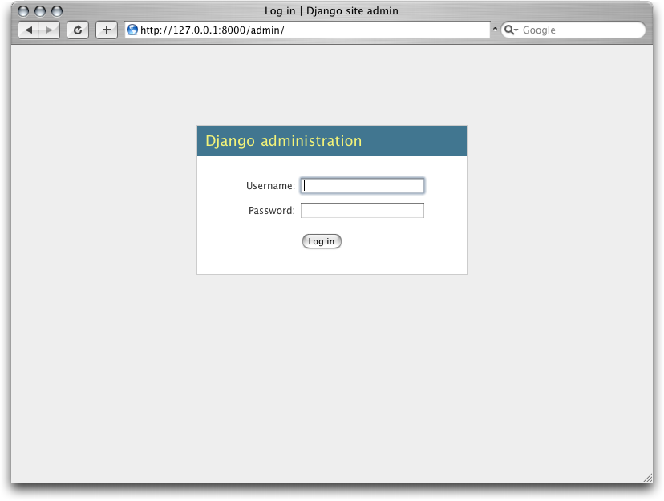
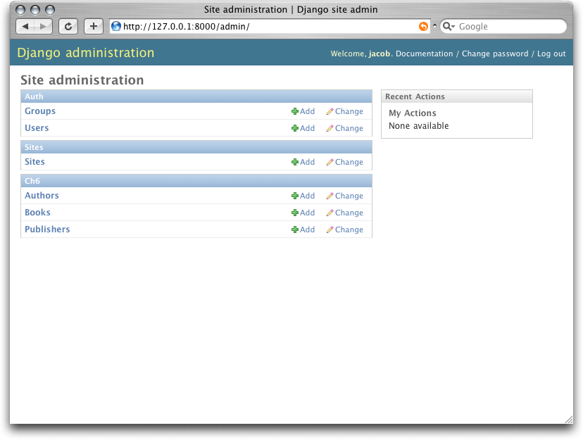
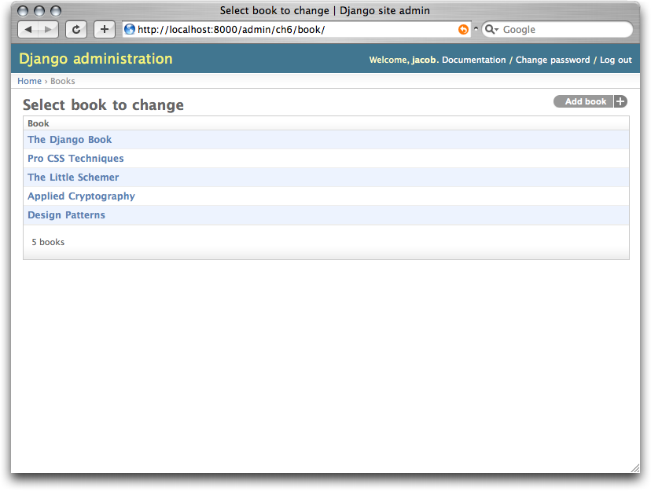
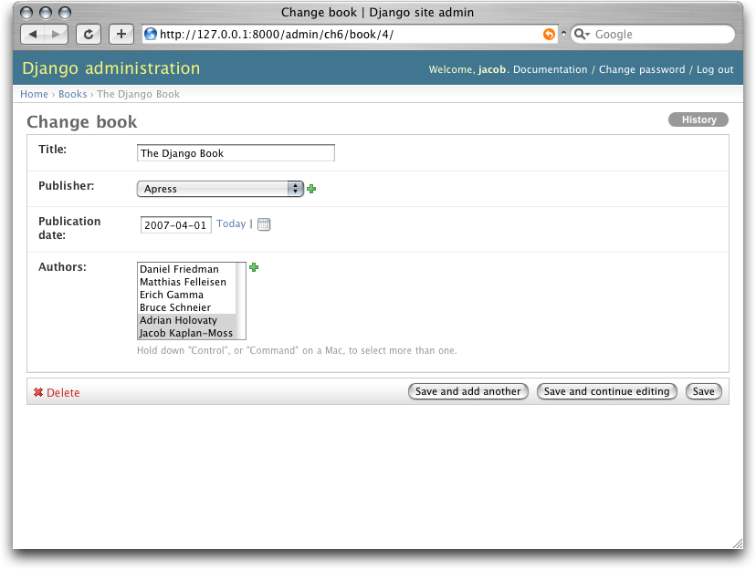
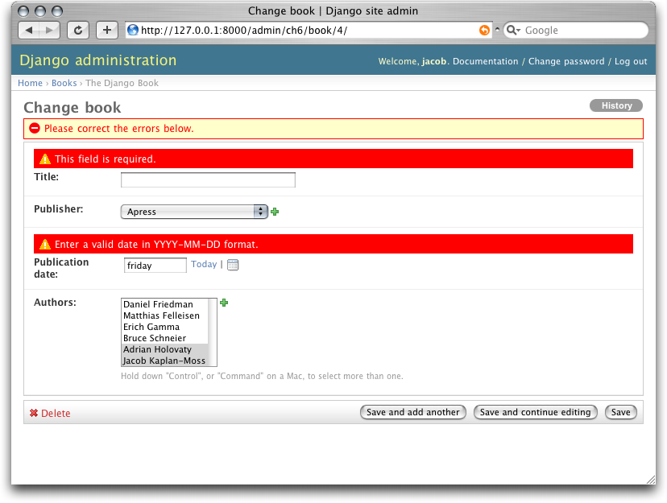
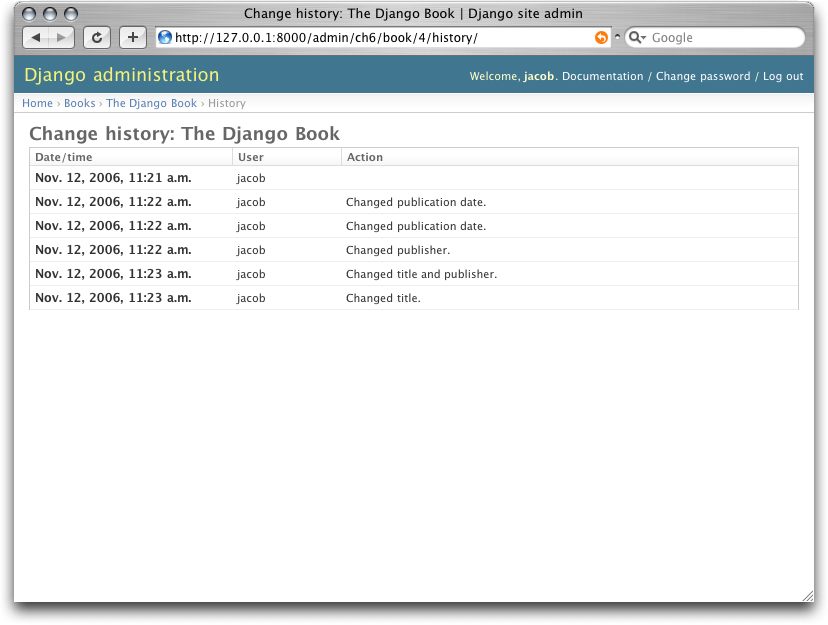
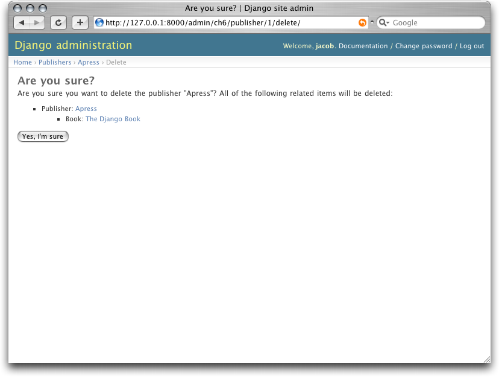
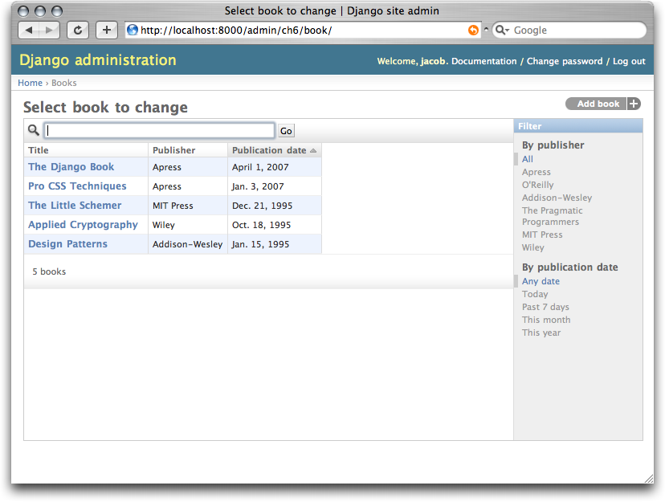

=========================================
Chapter 6: The Django Administration Site
=========================================

For a certain class of Web sites, an *admin interface* is an essential part of
the infrastructure. This is a Web-based interface, limited to trusted site
administrators, that enables the adding, editing and deletion of site content.
The interface you use to post to your blog, the backend site managers use to
moderate reader-generated comments, the tool your clients use to update the
press releases on the Web site you built for them -- these are all examples of
admin interfaces.

There's a problem with admin interfaces, though: it's boring to build them.
Web development is fun when you're developing public-facing functionality, but
building admin interfaces is always the same. You have to authenticate users,
display and handle forms, validate input, and so on. It's boring, and it's
repetitive.

So what's Django's approach to these boring, repetitive tasks? It does it all
for you--in just a couple of lines of code, no less. With Django, building an
admin interface is a solved problem.

This chapter is about Django's automatic admin interface. This feature works by
reading metadata in your model to provide a powerful and production-ready
interface that site administrators can start using immediately. Here, we discuss
how to activate, use, and customize this feature.

Activating the Admin Interface
==============================

We think the admin interface is the coolest part of Django--and most
Djangonauts agree--but since not everyone actually needs it, it's an
optional piece. That means there are three steps you'll need to follow to
activate it:

    1.  Add admin metadata to your models.

        Not all models can (or should) be editable by admin users, so you need
        to "mark" models that should have an admin interface. You do that by
        adding an inner ``Admin`` class to your model (alongside the ``Meta``
        class, if you have one). So, to add an admin interface to our
        ``Book`` model from the previous chapter, we use this:

        .. parsed-literal::

            class Book(models.Model):
                title = models.CharField(maxlength=100)
                authors = models.ManyToManyField(Author)
                publisher = models.ForeignKey(Publisher)
                publication_date = models.DateField()
                num_pages = models.IntegerField(blank=True, null=True)

                def __str__(self):
                    return self.title

                **class Admin:**
                    **pass**

        The ``Admin`` declaration flags the class as having an admin
        interface. There are a number of options that you can put beneath
        ``Admin``, but for now we're sticking with all the defaults, so we put
        ``pass`` in there to signify to Python that the ``Admin`` class is
        empty.

        If you're following this example with your own code, it's probably a
        good idea to add ``Admin`` declarations to the ``Publisher`` and
        ``Author`` classes at this point.

    2.  Install the admin application. Do this by adding ``"django.contrib.admin"``
        to your ``INSTALLED_APPS`` setting.

    3.  If you've been following along, make sure that ``"django.contrib.sessions"``,
        ``"django.contrib.auth"``, and ``"django.contrib.contenttypes"`` are
        uncommented, since the admin application depends on them.  Also uncomment
        all the lines in the ``MIDDLEWARE_CLASSES`` setting tuple and delete the
        ``TEMPLATE_CONTEXT_PROCESSOR`` setting to allow it to take
        the default values again.

    4.  Run ``python manage.py syncdb``. This step will install the extra database
        tables the admin interface uses.

        .. note::

            When you first run ``syncdb`` with ``"django.contrib.auth"`` in
            INSTALLED_APPS, you'll be asked about creating a superuser. If you
            didn't do so at that time, you'll need to run
            ``django/contrib/auth/bin/create_superuser.py`` to create an
            admin user. Otherwise, you won't be able to log in to the admin
            interface.

    5.  Add the URL pattern to your ``urls.py``. If you're still using the
        one created by ``startproject``, the admin URL pattern should be
        already there, but commented out. Either way, your URL patterns should
        look like the following:

        .. parsed-literal::

            from django.conf.urls.defaults import *

            urlpatterns = patterns('',
                **(r'^admin/', include('django.contrib.admin.urls')),**
            )

That's it. Now run ``python manage.py runserver`` to start the development
server. You'll see something like this::

    Validating models...
    0 errors found.

    Django version 0.96, using settings 'mysite.settings'
    Development server is running at http://127.0.0.1:8000/
    Quit the server with CONTROL-C.

Now you can visit the URL given to you by Django
(``http://127.0.0.1:8000/admin/`` in the preceding example), log in, and play
around.

Using the Admin Interface
=========================

The admin interface is designed to be used by nontechnical users, and as such it
should be pretty self-explanatory. Nevertheless, a few notes about the
features of the admin interface are in order.

The first thing you'll see is a login screen, as shown in Figure 6-1.

   Figure 6-1. Django's login screen

You'll use the username and password you set up when you added your superuser.
Once you're logged in, you'll see that you can manage users, groups, and
permissions (more on that shortly).

Each object given an ``Admin`` declaration shows up on the main index page, as
shown in Figure 6-2.

   Figure 6-2. The main Django admin index

Links to add and change objects lead to two pages we refer to as object
*change lists* and *edit forms*. Change lists are essentially index pages
of objects in the system, as shown in Figure 6-3.

   Figure 6-3. A typical change list view

A number of options control which fields appear on these
lists and the appearance of extra features like date drill-downs, search
fields, and filter interfaces. We discuss these features in more detail shortly.

Edit forms are used to modify existing objects and create new ones (see Figure
6-4). Each field defined in your model appears here, and you'll notice that
fields of different types get different widgets (e.g., date/time fields have
calendar controls, foreign keys use a select box, etc.).

   Figure 6-4. A typical edit form

You'll notice that the admin interface also handles input validation for you.
Try leaving a required field blank or putting an invalid time into a time field,
and you'll see those errors when you try to save, as shown in Figure 6-5.

   Figure 6-5. An edit form displaying errors

When you edit an existing object, you'll notice a History button in the
upper-right corner of the window. Every change made through the admin interface
is logged, and you can examine this log by clicking the History button (see
Figure 6-6).

   Figure 6-6. Django's object history page

When you delete an existing object, the admin interface asks you to confirm the
delete action to avoid costly mistakes. Deletions also *cascade*; the deletion
confirmation page shows you all the related objects that will be deleted as well
(see Figure 6-7).

   Figure 6-7. Django's delete confirmation page

Users, Groups, and Permissions
------------------------------

Since you're logged in as a superuser, you have access to create, edit, and
delete any object. However, the admin interface has a user permissions system
that you can use to give other users access only to the portions of the
interface that they need.

You edit these users and permissions through the admin interface just like any
other object. The link to the ``User`` and ``Group`` models is there on the
admin index along with all the objects you've defined yourself.

User objects have the standard username, password, e-mail, and real name fields
you might expect, along with a set of fields that define what the user is
allowed to do in the admin interface. First, there's a set of three flags:

    * The "is active" flag controls whether the user is active at all.
      If this flag is off, the user has no access to any URLs that
      require login.

    * The "is staff" flag controls whether the user is allowed to log in to the
      admin interface (i.e., whether that user is considered a "staff member" in
      your organization). Since this same user system can be used to control
      access to public (i.e., non-admin) sites (see Chapter 12), this flag
      differentiates between public users and administrators.

    * The "is superuser" flag gives the user full, unfettered access to
      every item in the admin interface; regular permissions are ignored.

"Normal" admin users--that is, active, non-superuser staff members--are granted
access that depends on a set of assigned permissions. Each object editable
through the admin interface has three permissions: a *create* permission, an
*edit* permission, and a *delete* permission. Assigning permissions to a user
grants the user access to do what is described by those permissions.

.. note::

    Access to edit users and permissions is also controlled by this permission
    system. If you give someone permission to edit users, she will be able to
    edit her own permissions, which might not be what you want!

You can also assign users to groups. A *group* is simply a set of permissions to
apply to all members of that group. Groups are useful for granting identical
permissions to large number of users.

Customizing the Admin Interface
===============================

You can customize the way the admin interface looks and behaves in a number of
ways. We cover just a few of them in this section as they relate to our ``Book``
model; Chapter 17 covers customizing the admin interface in detail.

As it stands now, the change list for our books shows only the string
representation of the model we added to its ``__str__``. This works fine for
just a few books, but if we had hundreds or thousands of books, it would be very
hard to locate a single needle in the haystack. However, we can easily add some
display, searching, and filtering functions to this interface. Change the
``Admin`` declaration as follows:

    .. parsed-literal::

        class Book(models.Model):
            title = models.CharField(maxlength=100)
            authors = models.ManyToManyField(Author)
            publisher = models.ForeignKey(Publisher)
            publication_date = models.DateField()

            class Admin:
                **list_display = ('title', 'publisher', 'publication_date')**
                **list_filter = ('publisher', 'publication_date')**
                **ordering = ('-publication_date',)**
                **search_fields = ('title',)**

These four lines of code dramatically change our list interface, as shown in
Figure 6-8.

   Figure 6-8. Modified change list page

Each of those lines instructed the admin interface to construct a different
piece of this interface:

    * The ``list_display`` option controls which columns appear in the change
      list table. By default, the change list displays only a single column
      that contains the object's string representation. Here, we've changed
      that to show the title, publisher, and publication date.

    * The ``list_filter`` option creates the filtering bar on the right side
      of the list. We've allowed filtering by date (which allows you to
      see only books published in the last week, month, etc.) and by
      publisher.

      You can instruct the admin interface to filter by any field, but foreign
      keys, dates, Booleans, and fields with a ``choices`` attribute work best.
      The filters show up as long as there are at least 2 values to choose from.

    * The ``ordering`` option controls the order in which the objects are
      presented in the admin interface. It's simply a list of fields by which
      to order the results; prefixing a field with a minus sign reverses the given
      order. In this example, we're ordering by publication date, with the most
      recent first.

    * Finally, the ``search_fields`` option creates a field that allows text
      searches. It allows searches by the ``title`` field (so you could
      type **Django** to show all books with "Django" in the title).

Using these options (and the others described in Chapter 12) you can,
with only a few lines of code, make a very powerful, production-ready interface
for data editing.

Customizing the Admin Interface's Look and Feel
===============================================

Clearly, having the phrase "Django administration" at the top of each admin page
is ridiculous. It's just placeholder text.

It's easy to change, though, using Django's template system. The Django
admin site is powered by Django itself, and its interfaces use Django's own
template system. (Django's template system was covered in Chapter 4.)

As we explained in Chapter 4, the ``TEMPLATE_DIRS`` setting specifies a list
of directories to check when loading Django templates. To customize Django's
admin templates, simply copy the relevant stock admin template from the Django
distribution into your one of the directories pointed-to by ``TEMPLATE_DIRS``.

The admin site finds the "Django administration" header by looking for the
template ``admin/base_site.html``. By default, this template lives in the
Django admin template directory, ``django/contrib/admin/templates``, which you
can find by looking in your Python ``site-packages`` directory, or wherever
Django was installed. To customize this ``base_site.html`` template, copy that
template into an ``admin`` subdirectory of whichever directory you're using in
``TEMPLATE_DIRS``. For example, if your ``TEMPLATE_DIRS`` includes
``"/home/mytemplates"``, then copy
``django/contrib/admin/templates/admin/base_site.html`` to
``/home/mytemplates/admin/base_site.html``. Don't forget that ``admin``
subdirectory.

Then, just edit the new ``admin/base_site.html`` file to replace the
generic Django text with your own site's name as you see fit.

Note that any of Django's default admin templates can be overridden. To
override a template, just do the same thing you did with ``base_site.html``:
copy it from the default directory into your custom directory and make changes
to the copy.

You might wonder how, if ``TEMPLATE_DIRS`` was empty by default, Django found
the default admin templates. The answer is that, by default, Django
automatically looks for templates within a ``templates/`` subdirectory in each
application package as a fallback. See the "Writing Custom Template Loaders" in
Chapter 10 for more information about how this works.

Customizing the Admin Index Page
================================

On a similar note, you might want to customize the look and feel of the Django
admin index page. By default, it displays all available applications, according
to your ``INSTALLED_APPS`` setting, sorted by the name of the application. You
might, however, want to change this order to make it easier to find the
applications you're looking for. After all, the index is probably the most
important page of the admin interface, so it should be easy to use.

The template to customize is ``admin/index.html``. (Remember to copy
``admin/index.html`` to your custom template directory as in the previous
example.) Edit the file, and you'll see it uses a template tag called ````. This tag retrieves every installed Django
application. Instead of using the tag, you can hard-code links to
object-specific admin pages in whatever way you think is best. If hard-coding
links doesn't appeal to you, see Chapter 10 for details on implementing your own
template tags.

Django offers another shortcut in this department. Run the command ``python
manage.py adminindex <app>`` to get a chunk of template code for inclusion in
the admin index template. It's a useful starting point.

For full details on customizing the look and feel of the Django admin site in
general, see Chapter 17.

When and Why to Use the Admin Interface
=======================================

We think Django's admin interface is pretty spectacular. In fact, we'd call it
one of Django's "killer features." However, we often get asked about "use cases"
for the admin interface--when do *we* use it, and why? Over the years, we've
discovered a number of patterns for using the admin interface that we think
might be helpful.

Obviously, the admin interface is extremely useful for editing data (fancy
that). If you have any sort of data entry tasks, the admin interface simply
can't be beat. We suspect that the vast majority of readers of this book will
have a whole host of data entry tasks.

Django's admin interface especially shines when nontechnical users need to be
able to enter data; that's the purpose behind the feature, after all. At the
newspaper where Django was first developed, development of a typical online
feature--a special report on water quality in the municipal supply, say--goes
something like this:

    * The reporter responsible for the story meets with one of the developers
      and goes over the available data.

    * The developer designs a model around this data and then opens up the
      admin interface to the reporter.

    * While the reporter enters data into Django, the programmer can focus on
      developing the publicly accessible interface (the fun part!).

In other words, the raison d'être of Django's admin interface is facilitating
the simultaneous work of content producers and programmers.

However, beyond the obvious data entry tasks, we find the admin interface useful
in a few other cases:

    * *Inspecting data models*: The first thing we do when we've defined a new
      model is to call it up in the admin interface and enter some dummy data.
      This is usually when we find any data modeling mistakes; having a
      graphical interface to a model quickly reveals problems.

    * *Managing acquired data*: There's little actual data entry associated with
      a site like ``http://chicagocrime.org``, since most of the data comes from
      an automated source. However, when problems with the automatically
      acquired data crop up, it's useful to be able to go in and edit that data
      easily.

What's Next?
============

So far we've created a few models and configured a top-notch interface for
editing data. In the `next chapter`_, we'll move on to the real "meat and potatoes"
of Web development: form creation and processing.

.. _next chapter: ../chapter07/
