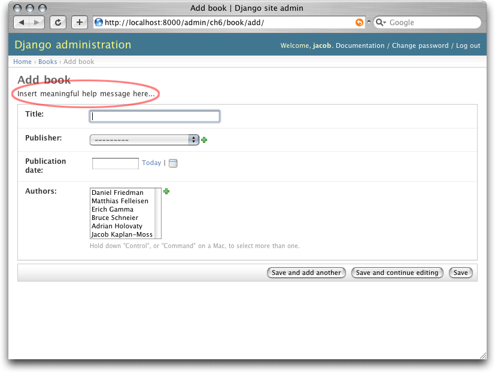
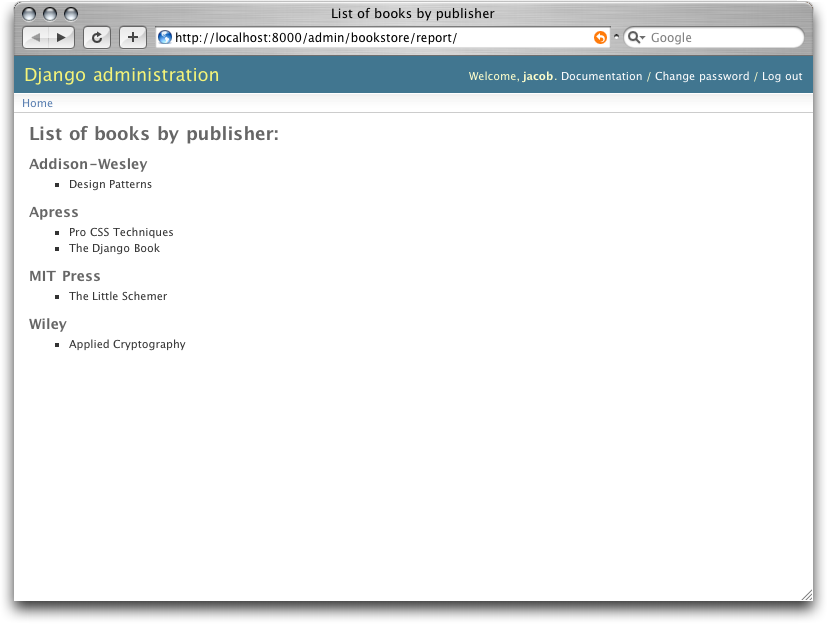

==============================================
Chapter 17: Extending Django's Admin Interface
==============================================

Chapter 6 introduced Django's admin interface, and now it's time to circle back
and take a closer look.

As we've said a few times before, Django's admin interface is one of the framework's
"killer features," and most Django developers find it time-saving and useful.
Because the admin interface is so popular, it's common for Django developers
to want to customize or extend it.

The last few sections of Chapter 6 offer some simple ways to customize certain
parts of the admin interface. Before proceeding with this chapter, consider
reviewing that material; it covers how to customize the admin interface's
change lists and edit forms, as well as an easy way to "rebrand" the admin interface to
match your site.

Chapter 6 also discusses when and why you'd want to use the admin interface, and
since that material makes a good jumping-off point for the rest of this chapter,
we'll reproduce it here:

    Obviously, the admin interface is extremely useful for editing data (fancy that).
    If you have any sort of data entry task, the admin interface simply can't be beat.
    We suspect that the vast majority of readers of this book will have a
    whole host of data entry tasks.

    Django's admin interface especially shines when nontechnical users need to be able
    to enter data; that's the purpose behind the feature, after all. At the
    newspaper where Django was first developed, development of a typical
    online feature -- a special report on water quality in the municipal
    supply, say -- goes something like this:

        * The reporter responsible for the story meets with one of the
          developers and goes over the available data.

        * The developer designs a model around this data and then opens up
          the admin interface to the reporter.

        * While the reporter enters data into Django, the programmer can focus
          on developing the publicly accessible interface (the fun part!).

    In other words, the raison d'être of Django's admin interface is facilitating
    the simultaneous work of content producers and programmers.

    However, beyond the obvious data entry tasks, we find the admin interface useful in
    a few other cases:

        * *Inspecting data models*: The first thing we do when we've defined a new
          model is to call it up in the admin interface and enter some dummy data.
          This is usually when we find any data modeling mistakes; having a
          graphical interface to a model quickly reveals problems.

        * *Managing acquired data*: There's little actual data entry associated with
          a site like ``http://chicagocrime.org``, since most of the data comes from
          an automated source. However, when problems with the automatically
          acquired data crop up, it's useful to be able to go in and edit that data
          easily.

Django's admin interface handles these common cases with little or no customization. As
with most design tradeoffs, though, handling these common cases so well means
that Django's admin interface doesn't handle some other modes of editing as well.

We'll talk about the cases Django's admin interface *isn't* designed to cover a bit
later on, but first, let's briefly digress to a discussion on philosophy.

The Zen of Admin
================

At its core, Django's admin interface is designed for a single activity:

    Trusted users editing structured content.

Yes, it's extremely simple -- but that simplicity is based on a whole host of
assumptions. The entire philosophy of Django's admin interface follows directly from
these assumptions, so let's dig into the subtext of this phrase in the sections that follow.

"Trusted users ..."
-------------------

The admin interface is designed to be used by people whom you, the developer, *trust*.
This doesn't just mean "people who have been authenticated"; it means that
Django assumes that your content editors can be trusted to do the right thing.

This in turn means that there's no approval process for editing content -- if you
trust your users, nobody needs to approve of their edits. Another implication is that
the permission system, while powerful, has no support for limiting access on a
per-object basis as of this writing. If you trust someone to edit his or her own
stories, you trust that user not to edit anyone else's stories without permission.

"... editing ..."
-----------------

The primary purpose of Django's admin interface is to let people edit data. This seems
obvious at first, but again it has some subtle and powerful repercussions.

For instance, although the admin interface is quite useful for reviewing data (as just
described), it's not designed with that purpose in mind. For example, note the lack of a
"can view" permission (see Chapter 12). Django assumes that if people are allowed
to view content in the admin interface, they're also allowed to edit it.

Another more important thing to note is the lack of anything even remotely approaching
"workflow." If a given task requires a series of steps, there's no support
for enforcing that those steps be done in any particular order. Django's admin interface
focuses on *editing*, not on activities surrounding editing. This
avoidance of workflow also stems from the principle of trust: the admin interface's
philosophy is that workflow is a personnel issue, not something to be implemented in
code.

Finally, note the lack of aggregation in the admin interface. That is, there's no
support for displaying totals, averages, and so forth. Again, the admin interface is
for editing -- it's expected that you'll write custom views for all the rest.

"... structured content"
------------------------

As with the rest of Django, the admin interface wants you to work with structured data.
Thus, it only supports editing data stored in Django models; for
anything else, such as data stored on a filesystem, you'll need custom views.

Full Stop
---------

It should be clear by now that Django's admin interface does *not* try to be all things
to all people; instead, we choose to focus tightly on one thing and do that
thing extremely well.

When it comes to extending Django's admin interface, much of that same philosophy
holds (note that "extensibility" shows up nowhere in our goals). Because custom
Django views can do *anything*, and because they can easily be visually
integrated into the admin interface (as described in the next section), the built-in
opportunities for customizing the admin interface are somewhat limited by design.

You should keep in mind that the admin interface is "just an app," albeit a very
complicated one. It doesn't do anything that any Django developer with
sufficient time couldn't reproduce. It's entirely possible that in the future
someone will develop a different admin interface that is based on a different set of
assumptions and thus will behave differently.

Finally, we should point out that, as of this writing, Django developers were
working on a new version of the admin interface that allows for much more
flexibility in customization. By the time you read this, those new features may
have made their way into the bona fide Django distribution. To find out, ask
somebody in the Django community whether the "newforms-admin" branch has been
integrated.

Customizing Admin Templates
===========================

Out of the box, Django provides a number of tools for customizing the built-in
admin templates, which we'll go over shortly, but for tasks beyond that (e.g.,
anything requiring custom workflow or granular permissions),
you'll need to read the section titled "Creating Custom Admin Views" later in this
chapter.

For now, though, let's look at some quick ways of customizing the appearance
(and, to some extent, behavior) of the admin interface. Chapter 6 covers a few of the
most common tasks: "rebranding" the Django admin interface (for those pointy-haired
bosses who hate blue) and providing a custom admin form.

Past that point, the goal usually involves changing some of the templates for
a particular item. Each of the admin views -- the change lists, edit forms,
delete confirmation pages, and history views -- has an associated template
that can be overridden in a number of ways.

First, you can override the template globally. The admin view looks for
templates using the standard template-loading mechanism, so if you create
templates in one of your template directories, Django will load those instead
of the default admin templates bundled with Django. These global templates are
outlined in Table 17-1.

.. table:: Table 17-1. Global Admin Templates

    ======================  ==================================================
    View                    Base Template Name
    ======================  ==================================================
    Change list             ``admin/change_list.html``
    Add/edit form           ``admin/change_form.html``
    Delete confirmation     ``admin/delete_confirmation.html``
    Object history          ``admin/object_history.html``
    ======================  ==================================================

Most of the time, however, you'll want to change the template for just a single
object or application (not globally). Thus, each admin view looks for model- and
application-specific templates first. Those views look for templates in this order:

    * ``admin/<app_label>/<object_name>/<template>.html``
    * ``admin/<app_label>/<template>.html``
    * ``admin/<template>.html``

For example, the add/edit form view for a ``Book`` model in the ``books``
application looks for templates in this order:

    * ``admin/books/book/change_form.html``
    * ``admin/books/change_form.html``
    * ``admin/change_form.html``

Custom Model Templates
----------------------

Most of the time, you'll want to use the first template to create a
model-specific template. This is usually best done by extending the base
template and adding information to one of the blocks defined in that template.

For example, say we want to add a little bit of help text to the top
of that book page. Maybe something like the form shown in Figure 17-1.

   Figure 17-1. A customized admin edit form

This is pretty easy to do: simply create a template called
``admin/bookstore/book/change_form.html`` and insert this code::

    

    
      
Insert meaningful help message here...

    

All these templates define a number of blocks you can override. As with most
programs, the best documentation is the code, so we encourage you to look
through the admin templates (they're in ``django/contrib/admin/templates/``) for
the most up-to-date information.

Custom JavaScript
-----------------

A common use for these custom model templates involves adding custom
JavaScript to admin pages -- perhaps to implement some special widget or
client-side behavior.

Luckily, that couldn't be easier. Each admin template defines a ````, which you can use to put extra content into the ``<head>``
element. For example, if you want to include jQuery (http://jquery.com/) in
your admin history, it's as simple as this::

    

    
        
        
    

.. note::

    We're not sure why you'd need jQuery on the object history page, but, of
    course, this example applies to any of the admin templates.

You can use this technique to include any sort of extra JavaScript widgets you
might need.

Creating Custom Admin Views
===========================

At this point, anyone looking to add custom *behavior* to Django's admin interface is
probably starting to get a bit frustrated. "All you've talked about is how to
change the admin interface *visually*," we hear them cry. "But how do
I change the way the admin interface *works*?"

The first thing to understand is that *it's not magic*. That is, nothing the
admin interface does is "special" in any way -- the admin interface is just a set of
views (they live in ``django.contrib.admin.views``) that manipulate data just like any
other view.

Sure, there's quite a bit of code in there; it has to deal with all the
various options, field types, and settings that influence model behavior.
Still, when you realize that the admin interface is just a set of views, adding custom
admin views becomes easier to understand.

By way of example, let's add a "publisher report" view to our book application from
Chapter 6. We'll build an admin view that shows the list of books broken down
by publisher -- a pretty typical example of a custom admin "report" view you
might need to build.

First, let's wire up a view in our URLconf. We need to insert this line::

    (r'^admin/books/report/$', 'mysite.books.admin_views.report'),

*before* the line including the admin views. A bare-bones URLconf might look
like this::

    from django.conf.urls.defaults import *

    urlpatterns = patterns('',
        (r'^admin/bookstore/report/$', 'bookstore.admin_views.report'),
        (r'^admin/', include('django.contrib.admin.urls')),
    )

Why put the custom view *before* the admin inclusion? Recall that Django
processes URL patterns in order. The admin inclusion matches nearly anything
that falls under the inclusion point, so if we reverse the order of those lines,
Django will find a built-in admin view for that pattern, which won't work. In
this particular case, it will try to load a change list for a ``Report``
model in the ``books`` application, which doesn't exist.

Now let's write our view. For the sake of simplicity, we'll just load all books
into the context and let the template handle the grouping with the
```` tag. Create a file, ``books/admin_views.py``, with this
code::

    from mysite.books.models import Book
    from django.template import RequestContext
    from django.shortcuts import render_to_response
    from django.contrib.admin.views.decorators import staff_member_required

    def report(request):
        return render_to_response(
            "admin/books/report.html",
            {'book_list' : Book.objects.all()},
            RequestContext(request, {}),
        )
    report = staff_member_required(report)

Because we left the grouping up to the template, this view is pretty simple.
However, there are some subtle bits here worth making explicit:

    * We use the ``staff_member_required`` decorator from
      ``django.contrib.admin.views.decorators``.  This is similar to the
      ``login_required`` decorator discussed in Chapter 12, but this decorator
      also checks that the given user is marked as a "staff" member, and thus
      is allowed access to the admin interface.

      This decorator protects all the built-in admin views and makes the
      authentication logic for your view match the rest of the admin interface.

    * We render a template located under ``admin/``. While this isn't strictly
      required, it's considered good practice to keep all your admin templates
      grouped in an ``admin`` directory. We've also put the template in a
      directory named ``books`` after our application -- also a best practice.

    * We use ``RequestContext`` as the third parameter (``context_instance``)
      to ``render_to_response``. This ensures that information about the
      current user is available to the template.

      See Chapter 10 for more about ``RequestContext``.

Finally, we'll make a template for this view. We'll extend the built-in admin
templates to make this view visually appear to be part of the admin interface::

    

    List of books by publisher

    
    

      <h1>List of books by publisher:</h1>
      
      
        <h3>{{ publisher.grouper }}</h3>
        <ul>
          
            <li>{{ book }}</li>
          
        </ul>
      
    

    

By extending ``admin/base_site.html``, we get the look and feel of the Django
admin "for free." Figure 17-2 shows what the end result looks like.

   Figure 17-2. A custom "books by publisher" admin view

You can use this technique to add anything you can dream of to the admin interface.
Remember that these so-called custom admin views are really just normal
Django views; you can use all the techniques you learn in the rest of this
book to provide as complex an admin interface as you need.

We'll close out this chapter with some ideas for custom admin views.

Overriding Built-in Views
=========================

At times the default admin views just don't cut it. You can easily swap in
your own custom view for any stage of the admin interface; just let your URL
"shadow" the built-in admin one. That is, if your view comes before the default
admin view in the URLconf, your view will be called instead of the default one.

For example, we could replace the built-in "create" view for a book with a
form that lets the user simply enter an ISBN. We could then look up the book's
information from http://isbn.nu/ and create the object automatically.

The code for such a view is left as an exercise for the reader, but the
important part is this URLconf snippet::

    (r'^admin/bookstore/book/add/$', 'mysite.books.admin_views.add_by_isbn'),

If this bit comes before the admin URLs in your URLconf, the ``add_by_isbn``
view will completely replace the standard admin view.

We could follow a similar tack to replace a delete confirmation page, the edit
page, or any other part of the admin interface.

What's Next?
============

If you're a native English speaker--and we expect that many readers of this
English-language book are--you might not have noticed one of the coolest
features of the admin interface: it's available in almost 40 different
languages! This is made possible by Django's internationalization framework (and the hard
work of Django's volunteer translators). The `next chapter`_ explains how to use
this framework to provide localized Django sites.

Avanti!

.. _next chapter: ../chapter18/
