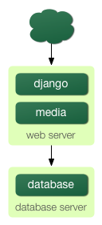
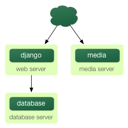
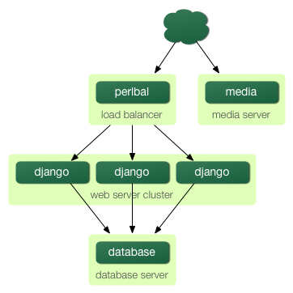
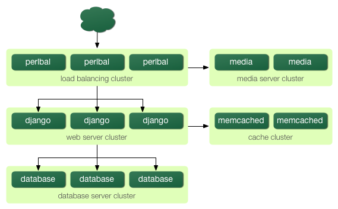

============================
Chapter 20: Deploying Django
============================

Throughout this book, we've mentioned a number of goals that drive the
development of Django. Ease of use, friendliness to new programmers,
abstraction of repetitive tasks -- these all drive Django's developers.

However, since Django's inception, there's always been another important goal:
Django should be easy to deploy, and it should make serving large amounts of
traffic possible with limited resources.

The motivations for this goal are apparent when you look at Django's
background: a small, family-owned newspaper in Kansas can hardly afford
top-of-the-line server hardware, so Django's original developers were
concerned with squeezing the best possible performance out of limited
resources. Indeed, for years Django's developers acted as their own system
administrators -- there simply wasn't enough hardware to *need* dedicated
sysadmins -- even as their sites handled tens of millions of hits a day.

As Django became an open source project, this focus on performance and ease of
deployment became important for a different reason: hobbyist developers have
the same requirements. Individuals who want to use Django are pleased to learn
they can host a small- to medium-traffic site for as little as $10 a month.

But being able to scale down is only half the battle. Django also needs to be
capable of scaling *up* to meet the needs of large companies and corporations.
Here, Django adopts a philosophy common among LAMP-like Web stacks often
called *shared nothing*.

.. admonition:: What's LAMP?

    The acronym LAMP was originally coined to describe a popular set
    of open source software used to drive many Web sites:

        * Linux (operating system)
        * Apache (Web server)
        * MySQL (database)
        * PHP (programming language)

    Over time, though, the acronym has come to refer more to the philosophy of
    these types of open source software stacks than to any one particular
    stack. So while Django uses Python and is database-agnostic, the
    philosophies proven by the LAMP stack permeate Django's deployment
    mentality.

    There have been a few (mostly humorous) attempts at coining a similar
    acronym to describe Django's technology stack. The authors of this book are
    fond of LAPD (Linux, Apache, PostgreSQL, and Django) or PAID (PostgreSQL,
    Apache, Internet, and Django). Use Django and get PAID!

Shared Nothing
==============

At its core, the philosophy of shared nothing is really just the application
of loose coupling to the entire software stack. This architecture arose in
direct response to what was at the time the prevailing architecture: a
monolithic Web application server that encapsulates the language, database, and
Web server -- even parts of the operating system -- into a single process
(e.g., Java).

When it comes time to scale, this can be a major problem; it's nearly
impossible to split the work of a monolithic process across many different
physical machines, so monolithic applications require enormously powerful
servers. These servers, of course, cost tens or even hundreds of thousands of
dollars, putting large-scale Web sites out of the reach of cash-hungry
individuals and small companies.

What the LAMP community noticed, however, was that if you broke each piece of
the Web stack up into individual components, you could easily start with an
inexpensive server and simply add more inexpensive servers as you grew. If
your $3,000 database server couldn't handle the load, you'd simply buy a
second (or third, or fourth) until it could. If you needed more storage
capacity, you'd add an NFS server.

For this to work, though, Web applications had to stop assuming that the same
server would handle each request -- or even each part of a single request. In
a large-scale LAMP (and Django) deployment, as many as half a dozen servers
might be involved in handling a single page! The repercussions of this are
numerous, but they boil down to these points:

    * *State cannot be saved locally*. In other words, any data that must be
      available between multiple requests must be stored in some sort of
      persistent storage like the database or a centralized cache.

    * *Software cannot assume that resources are local*. For example, the Web
      platform cannot assume that the database runs on the same server; it
      must be capable of connecting to a remote database server.

    * *Each piece of the stack must be easily moved or replicated*. If Apache
      for some reason doesn't work for a given deployment, you should be
      able to swap it out for another server with a minimum of fuss. Or,
      on a hardware level, if a Web server fails, you should be able to
      replace it with another physical box with minimum downtime. Remember,
      this whole philosophy is based around deployment on cheap, commodity
      hardware. Failure of individual machines is to be expected.

As you've probably come to expect, Django handles this more or less
transparently -- no part of Django violates these principles -- but knowing
the philosophy helps when it comes time to scale up.

.. admonition:: But Does It Work?

    This philosophy might sound good on paper (or on your screen), but
    does it actually work?

    Well, instead of answering directly, let's instead look at a
    by-no-means-complete list of a few companies that have based their business
    on this architecture. You might recognize some of these names:

        * Amazon
        * Blogger
        * Craigslist
        * Facebook
        * Google
        * LiveJournal
        * Slashdot
        * Wikipedia
        * Yahoo
        * YouTube

    To paraphrase the famous scene from *When Harry Met Sally...*: "We'll have
    what they're having!"

A Note on Personal Preferences
==============================

Before we get into the details, a quick aside.

Open source is famous for its so-called religious wars; much (digital) ink
has been spilled arguing over text editors (``emacs`` vs. ``vi``), operating
systems (Linux vs. Windows vs. Mac OS), database engines (MySQL vs.
PostgreSQL), and -- of course -- programming languages.

We try to stay away from these battles. There just isn't enough time.

However, there are a number of choices when it comes to deploying Django, and
we're constantly asked for our preferences. Since stating these preferences
comes dangerously close to firing a salvo in one of the aforementioned battles,
we've mostly refrained. However, for the sake of completeness and full
disclosure, we'll state them here. We prefer the following:

    * Linux (Ubuntu, specifically) as our operating system

    * Apache and mod_python for the Web server

    * PostgreSQL as a database server

Of course, we can point to many Django users who have made other choices with
great success.

Using Django with Apache and mod_python
============================================

Apache with mod_python currently is the most robust setup for using Django
on a production server.

mod_python (http://www.djangoproject.com/r/mod_python/) is an Apache plug-in
that embeds Python within Apache and loads Python code into memory when the
server starts. Code stays in memory throughout the life of an Apache process,
which leads to significant performance gains over other server arrangements.

Django requires Apache 2.x and mod_python 3.x, and we prefer Apache's
prefork MPM, as opposed to the worker MPM.

.. note::

    Configuring Apache is *well* beyond the scope of this book, so
    we'll simply mention details as needed. Luckily, a
    number of great resources are available if you need to learn more
    about Apache. A few of them we like are as follows:

        * The free online Apache documentation, available via
          http://www.djangoproject.com/r/apache/docs/

        * *Pro Apache, Third Edition* (Apress, 2004) by Peter Wainwright,
          available via http://www.djangoproject.com/r/books/pro-apache/

        * *Apache: The Definitive Guide, Third Edition* (O'Reilly, 2002) by Ben
          Laurie and Peter Laurie, available via
          http://www.djangoproject.com/r/books/apache-pra/

Basic Configuration
-------------------

To configure Django with mod_python, first make sure you have Apache installed
with the mod_python module activated. This usually means having a
``LoadModule`` directive in your Apache configuration file. It will look something
like this::

    LoadModule python_module /usr/lib/apache2/modules/mod_python.so

Then, edit your Apache configuration file and add the following::

    <Location "/">
        SetHandler python-program
        PythonHandler django.core.handlers.modpython
        SetEnv DJANGO_SETTINGS_MODULE mysite.settings
        PythonDebug On
    </Location>

Make sure to replace ``mysite.settings`` with the appropriate
``DJANGO_SETTINGS_MODULE`` for your site.

This tells Apache, "Use mod_python for any URL at or under '/', using the
Django mod_python handler." It passes the value of ``DJANGO_SETTINGS_MODULE``
so mod_python knows which settings to use.

Note that we're using the ``<Location>`` directive, not the ``<Directory>``
directive. The latter is used for pointing at places on your filesystem,
whereas ``<Location>`` points at places in the URL structure of a Web site.
``<Directory>`` would be meaningless here.

Apache likely runs as a different user than your normal login and may have a
different path and sys.path.  You may need to tell mod_python how to find your
project and Django itself. ::

    PythonPath "['/path/to/project', '/path/to/django'] + sys.path"

You can also add directives such as ``PythonAutoReload Off`` for performance.
See the mod_python documentation for a full list of options.

Note that you should set ``PythonDebug Off`` on a production server. If you
leave ``PythonDebug On``, your users will see ugly (and revealing) Python
tracebacks if something goes wrong within mod_python.

Restart Apache, and any request to your site (or virtual host if you've put
this directive inside a ``<VirtualHost>`` block) will be served by Django.

.. note::

    If you deploy Django at a subdirectory -- that is, somewhere deeper than
    "/" -- Django *won't* trim the URL prefix off of your URLpatterns. So
    if your Apache config looks like this::

        <Location "/mysite/">
            SetHandler python-program
            PythonHandler django.core.handlers.modpython
            SetEnv DJANGO_SETTINGS_MODULE mysite.settings
            PythonDebug On
        </Location>

    then *all* your URL patterns will need to start with ``"/mysite/"``. For
    this reason we usually recommend deploying Django at the root of your
    domain or virtual host.  Alternatively, you can simply shift your URL
    configuration down one level by using a shim URLconf::

        urlpatterns = patterns('',
            (r'^mysite/', include('normal.root.urls')),
        )

Running Multiple Django Installations on the Same Apache Instance
-----------------------------------------------------------------

It's entirely possible to run multiple Django installations on the same Apache
instance. You might want to do this if you're an independent Web developer with
multiple clients but only a single server.

To accomplish this, just use ``VirtualHost`` like so::

    NameVirtualHost *

    <VirtualHost *>
        ServerName www.example.com
        # ...
        SetEnv DJANGO_SETTINGS_MODULE mysite.settings
    </VirtualHost>

    <VirtualHost *>
        ServerName www2.example.com
        # ...
        SetEnv DJANGO_SETTINGS_MODULE mysite.other_settings
    </VirtualHost>

If you need to put two Django installations within the same ``VirtualHost``,
you'll need to take a special precaution to ensure mod_python's code cache
doesn't mess things up. Use the ``PythonInterpreter`` directive to give
different ``<Location>`` directives separate interpreters::

    <VirtualHost *>
        ServerName www.example.com
        # ...
        <Location "/something">
            SetEnv DJANGO_SETTINGS_MODULE mysite.settings
            PythonInterpreter mysite
        </Location>

        <Location "/otherthing">
            SetEnv DJANGO_SETTINGS_MODULE mysite.other_settings
            PythonInterpreter mysite_other
        </Location>
    </VirtualHost>

The values of ``PythonInterpreter`` don't really matter, as long as they're
different between the two ``Location`` blocks.

Running a Development Server with mod_python
--------------------------------------------

Because mod_python caches loaded Python code, when deploying Django sites on
mod_python you'll need to restart Apache each time you make changes to your
code. This can be a hassle, so here's a quick trick to avoid it: just add
``MaxRequestsPerChild 1`` to your config file to force Apache to reload
everything for each request. But don't do that on a production server, or we'll
revoke your Django privileges.

If you're the type of programmer who debugs using scattered ``print``
statements (we are), note that ``print`` statements have no effect in
mod_python; they don't appear in the Apache log, as you might expect. If you
have the need to print debugging information in a mod_python setup, you'll
probably want to use Python's standard logging package.  More information is
available at http://docs.python.org/lib/module-logging.html.  Alternatively,
you can or add the debugging information to the template of your page.

Serving Django and Media Files from the Same Apache Instance
------------------------------------------------------------

Django should not be used to serve media files itself; leave that job to
whichever Web server you choose. We recommend using a separate Web server
(i.e., one that's not also running Django) for serving media. For more
information, see the "Scaling" section.

If, however, you have no option but to serve media files on the same Apache
``VirtualHost`` as Django, here's how you can turn off mod_python for a
particular part of the site::

    <Location "/media/">
        SetHandler None
    </Location>

Change ``Location`` to the root URL of your media files.

You can also use ``<LocationMatch>`` to match a regular expression. For
example, this sets up Django at the site root but explicitly disables Django
for the ``media`` subdirectory and any URL that ends with ``.jpg``, ``.gif``,
or ``.png``::

    <Location "/">
        SetHandler python-program
        PythonHandler django.core.handlers.modpython
        SetEnv DJANGO_SETTINGS_MODULE mysite.settings
    </Location>

    <Location "/media/">
        SetHandler None
    </Location>

    <LocationMatch "\.(jpg|gif|png)$">
        SetHandler None
    </LocationMatch>

In all of these cases, you'll need to set the ``DocumentRoot`` directive so
Apache knows where to find your static files.

Error Handling
--------------

When you use Apache/mod_python, errors will be caught by Django -- in other
words, they won't propagate to the Apache level and won't appear in the Apache
``error_log``.

The exception to this is if something is really messed up in your Django
setup. In that case, you'll see an "Internal Server Error" page in your
browser and the full Python traceback in your Apache ``error_log`` file. The
``error_log`` traceback is spread over multiple lines. (Yes, this is ugly and
rather hard to read, but it's how mod_python does things.)

Handling a Segmentation Fault
-----------------------------

Sometimes, Apache segfaults when you install Django. When this happens, it's
almost *always* one of two causes mostly unrelated to Django itself:

    * It may be that your Python code is importing the ``pyexpat`` module
      (used for XML parsing), which may conflict with the version embedded in
      Apache. For full information, see "Expat Causing Apache Crash" at
      http://www.djangoproject.com/r/articles/expat-apache-crash/.

    * It may be because you're running mod_python and mod_php in the same
      Apache instance, with MySQL as your database back-end. In some cases, this
      causes a known mod_python issue due to version conflicts in PHP and the
      Python MySQL back-end. There's full information in a mod_python FAQ entry,
      accessible via http://www.djangoproject.com/r/articles/php-modpython-faq/.

If you continue to have problems setting up mod_python, a good thing to do is
get a bare-bones mod_python site working, without the Django framework. This is
an easy way to isolate mod_python-specific problems. The article "Getting mod_python
Working" details this procedure:
http://www.djangoproject.com/r/articles/getting-modpython-working/.

The next step should be to edit your test code and add an import of any
Django-specific code you're using -- your views, your models, your URLconf,
your RSS configuration, and so forth. Put these imports in your test handler function
and access your test URL in a browser. If this causes a crash, you've
confirmed it's the importing of Django code that causes the problem. Gradually
reduce the set of imports until it stops crashing, so as to find the specific
module that causes the problem. Drop down further into modules and look into
their imports as necessary.  For more help, system tools like ``ldconfig`` on
Linux, ``otool`` on Mac OS, and ``ListDLLs`` (from SysInternals) on Windows
can help you identify shared dependencies and possible version conflicts.

Using Django with FastCGI
=========================

Although Django under Apache and mod_python is the most robust deployment
setup, many people use shared hosting, on which FastCGI is the only available
deployment option.

Additionally, in some situations, FastCGI allows better security and possibly
better performance than mod_python. For small sites, FastCGI can also be more
lightweight than Apache.

FastCGI Overview
----------------

FastCGI is an efficient way of letting an external application serve pages to
a Web server. The Web server delegates the incoming Web requests (via a
socket) to FastCGI, which executes the code and passes the response back to
the Web server, which, in turn, passes it back to the client's Web browser.

Like mod_python, FastCGI allows code to stay in memory, allowing requests to
be served with no startup time. Unlike mod_python, a FastCGI process doesn't
run inside the Web server process, but in a separate, persistent process.

.. admonition:: Why Run Code in a Separate Process?

    The traditional ``mod_*`` arrangements in Apache embed various scripting
    languages (most notably PHP, Python/mod_python, and Perl/mod_perl) inside
    the process space of your Web server. Although this lowers startup time
    (because code doesn't have to be read off disk for every request), it comes
    at the cost of memory use.

    Each Apache process gets a copy of the Apache engine, complete with all
    the features of Apache that Django simply doesn't take advantage of.
    FastCGI processes, on the other hand, only have the memory overhead of
    Python and Django.

    Due to the nature of FastCGI, it's also possible to have processes that
    run under a different user account than the Web server process. That's a
    nice security benefit on shared systems, because it means you can secure
    your code from other users.

Before you can start using FastCGI with Django, you'll need to install ``flup``,
a Python library for dealing with FastCGI. Some users have reported
stalled pages with older ``flup`` versions, so you may want to use the latest
SVN version. Get ``flup`` at http://www.djangoproject.com/r/flup/.

Running Your FastCGI Server
---------------------------

FastCGI operates on a client/server model, and in most cases you'll be
starting the FastCGI server process on your own. Your Web server (be it
Apache, lighttpd, or otherwise) contacts your Django-FastCGI process only when
the server needs a dynamic page to be loaded. Because the daemon is already
running with the code in memory, it's able to serve the response very quickly.

.. admonition:: Note

    If you're on a shared hosting system, you'll probably be forced to use Web
    server-managed FastCGI processes. If you're in this situation, you should
    read the section titled "Running Django on a Shared-Hosting Provider with
    Apache," below.

A Web server can connect to a FastCGI server in one of two ways: it can use
either a Unix domain socket (a *named pipe* on Win32 systems) or a
TCP socket. What you choose is a manner of preference; a TCP socket is usually
easier due to permissions issues.

To start your server, first change into the directory of your project
(wherever your ``manage.py`` is), and then run ``manage.py`` with the
``runfcgi`` command::

    ./manage.py runfcgi [options]

If you specify ``help`` as the only option after ``runfcgi``, a
list of all the available options will display.

You'll need to specify either a ``socket`` or both ``host`` and ``port``.
Then, when you set up your Web server, you'll just need to point it at the
socket or host/port you specified when starting the FastCGI server.

A few examples should help explain this:

    * Running a threaded server on a TCP port::

        ./manage.py runfcgi method=threaded host=127.0.0.1 port=3033

    * Running a preforked server on a Unix domain socket::

        ./manage.py runfcgi method=prefork socket=/home/user/mysite.sock pidfile=django.pid

    * Run without daemonizing (backgrounding) the process (good for
      debugging)::

        ./manage.py runfcgi daemonize=false socket=/tmp/mysite.sock

Stopping the FastCGI Daemon
```````````````````````````

If you have the process running in the foreground, it's easy enough to stop
it: simply press Ctrl+C to stop and quit the FastCGI server. However,
when you're dealing with background processes, you'll need to resort to the
Unix ``kill`` command.

If you specify the ``pidfile`` option to your ``manage.py runfcgi``, you can
kill the running FastCGI daemon like this::

    kill `cat $PIDFILE`

where ``$PIDFILE`` is the ``pidfile`` you specified.

To easily restart your FastCGI daemon on Unix, you can use this small shell
script::

    #!/bin/bash

    # Replace these three settings.
    PROJDIR="/home/user/myproject"
    PIDFILE="$PROJDIR/mysite.pid"
    SOCKET="$PROJDIR/mysite.sock"

    cd $PROJDIR
    if [ -f $PIDFILE ]; then
        kill `cat -- $PIDFILE`
        rm -f -- $PIDFILE
    fi

    exec /usr/bin/env - \
      PYTHONPATH="../python:.." \
      ./manage.py runfcgi socket=$SOCKET pidfile=$PIDFILE

Using Django with Apache and FastCGI
------------------------------------

To use Django with Apache and FastCGI, you'll need Apache installed and
configured, with mod_fastcgi installed and enabled. Consult the Apache and
mod_fastcgi documentation for instructions:
http://www.djangoproject.com/r/mod_fastcgi/.

Once you've completed the setup, point Apache at your Django FastCGI instance by
editing the ``httpd.conf`` (Apache configuration) file. You'll need to do two
things:

    * Use the ``FastCGIExternalServer`` directive to specify the location of
      your FastCGI server.

    * Use ``mod_rewrite`` to point URLs at FastCGI as appropriate.

Specifying the Location of the FastCGI Server
`````````````````````````````````````````````

The ``FastCGIExternalServer`` directive tells Apache how to find your FastCGI
server. As the FastCGIExternalServer docs
(http://www.djangoproject.com/r/mod_fastcgi/FastCGIExternalServer/) explain, you
can specify either a ``socket`` or a ``host``. Here are examples of both::

    # Connect to FastCGI via a socket/named pipe:
    FastCGIExternalServer /home/user/public_html/mysite.fcgi -socket /home/user/mysite.sock

    # Connect to FastCGI via a TCP host/port:
    FastCGIExternalServer /home/user/public_html/mysite.fcgi -host 127.0.0.1:3033

In either case, the the directory /home/user/public_html/ should exist,
though the file ``/home/user/public_html/mysite.fcgi`` doesn't
actually have to exist. It's just a URL used by the Web server internally -- a
hook for signifying which requests at a URL should be handled by FastCGI.
(More on this in the next section.)

Using mod_rewrite to Point URLs at FastCGI
``````````````````````````````````````````

The second step is telling Apache to use FastCGI for URLs that match a certain
pattern. To do this, use the mod_rewrite module and rewrite URLs to
``mysite.fcgi`` (or whatever you specified in the ``FastCGIExternalServer``
directive, as explained in the previous section).

In this example, we tell Apache to use FastCGI to handle any request that
doesn't represent a file on the filesystem and doesn't start with ``/media/``.
This is probably the most common case, if you're using Django's admin site::

    <VirtualHost 12.34.56.78>
      ServerName example.com
      DocumentRoot /home/user/public_html
      Alias /media /home/user/python/django/contrib/admin/media
      RewriteEngine On
      RewriteRule ^/(media.*)$ /$1 [QSA,L]
      RewriteCond %{REQUEST_FILENAME} !-f
      RewriteRule ^/(.*)$ /mysite.fcgi/$1 [QSA,L]
    </VirtualHost>

FastCGI and lighttpd
--------------------

lighttpd (http://www.djangoproject.com/r/lighttpd/) is a lightweight Web server
commonly used for serving static files. It supports FastCGI natively and thus
is also an ideal choice for serving both static and dynamic pages, if your site
doesn't have any Apache-specific needs.

Make sure ``mod_fastcgi`` is in your modules list, somewhere after
``mod_rewrite`` and ``mod_access``, but not after ``mod_accesslog``. You'll
probably want ``mod_alias`` as well, for serving admin media.

Add the following to your lighttpd config file::

    server.document-root = "/home/user/public_html"
    fastcgi.server = (
        "/mysite.fcgi" => (
            "main" => (
                # Use host / port instead of socket for TCP fastcgi
                # "host" => "127.0.0.1",
                # "port" => 3033,
                "socket" => "/home/user/mysite.sock",
                "check-local" => "disable",
            )
        ),
    )
    alias.url = (
        "/media/" => "/home/user/django/contrib/admin/media/",
    )

    url.rewrite-once = (
        "^(/media.*)$" => "$1",
        "^/favicon\.ico$" => "/media/favicon.ico",
        "^(/.*)$" => "/mysite.fcgi$1",
    )

Running Multiple Django Sites on One lighttpd Instance
``````````````````````````````````````````````````````

lighttpd lets you use "conditional configuration" to allow configuration to be
customized per host. To specify multiple FastCGI sites, just add a conditional
block around your FastCGI config for each site::

    # If the hostname is 'www.example1.com'...
    $HTTP["host"] == "www.example1.com" {
        server.document-root = "/foo/site1"
        fastcgi.server = (
           ...
        )
        ...
    }

    # If the hostname is 'www.example2.com'...
    $HTTP["host"] == "www.example2.com" {
        server.document-root = "/foo/site2"
        fastcgi.server = (
           ...
        )
        ...
    }

You can also run multiple Django installations on the same site simply by
specifying multiple entries in the ``fastcgi.server`` directive. Add one
FastCGI host for each.

Running Django on a Shared-Hosting Provider with Apache
-------------------------------------------------------

Many shared-hosting providers don't allow you to run your own server daemons
or edit the ``httpd.conf`` file. In these cases, it's still possible to run
Django using Web server-spawned processes.

.. admonition:: Note

    If you're using Web server-spawned processes, as explained in this
    section, there's no need for you to start the FastCGI server on your own.
    Apache will spawn a number of processes, scaling as it needs to.

In your Web root directory, add this to a file named ``.htaccess`` ::

    AddHandler fastcgi-script .fcgi
    RewriteEngine On
    RewriteCond %{REQUEST_FILENAME} !-f
    RewriteRule ^(.*)$ mysite.fcgi/$1 [QSA,L]

Then, create a small script that tells Apache how to spawn your FastCGI
program. Create a file, ``mysite.fcgi``, and place it in your Web directory, and
be sure to make it executable ::

    #!/usr/bin/python
    import sys, os

    # Add a custom Python path.
    sys.path.insert(0, "/home/user/python")

    # Switch to the directory of your project. (Optional.)
    # os.chdir("/home/user/myproject")

    # Set the DJANGO_SETTINGS_MODULE environment variable.
    os.environ['DJANGO_SETTINGS_MODULE'] = "myproject.settings"

    from django.core.servers.fastcgi import runfastcgi
    runfastcgi(method="threaded", daemonize="false")

Restarting the Spawned Server
`````````````````````````````

If you change any Python code on your site, you'll need to tell FastCGI the
code has changed. But there's no need to restart Apache in this case. Rather,
just reupload ``mysite.fcgi`` -- or edit the file -- so that the timestamp
on the file changes. When Apache sees the file has been updated, it will
restart your Django application for you.

If you have access to a command shell on a Unix system, you can accomplish
this easily by using the ``touch`` command::

    touch mysite.fcgi

Scaling
=======

Now that you know how to get Django running on a single server, let's look at
how you can scale out a Django installation. This section walks through how
a site might scale from a single server to a large-scale cluster that could
serve millions of hits an hour.

It's important to note, however, that nearly every large site is large in
different ways, so scaling is anything but a one-size-fits-all operation. The
following coverage should suffice to show the general principle, and whenever
possible we'll try to point out where different choices could be made.

First off, we'll make a pretty big assumption and exclusively talk about
scaling under Apache and mod_python. Though we know of a number of successful
medium- to large-scale FastCGI deployments, we're much more familiar with
Apache.

Running on a Single Server
--------------------------

Most sites start out running on a single server, with an architecture that
looks something like Figure 20-1.

.. figure:: graphics/chapter20/scaling-1.png

   Figure 20-1: a single server Django setup.

This works just fine for small- to medium-sized sites, and it's relatively cheap -- you
can put together a single-server site designed for Django for well under $3,000.

However, as traffic increases you'll quickly run into *resource contention*
between the different pieces of software. Database servers and Web servers
*love* to have the entire server to themselves, so when run on the same server
they often end up "fighting" over the same resources (RAM, CPU) that they'd
prefer to monopolize.

This is solved easily by moving the database server to a second machine,
as explained in the following section.

Separating Out the Database Server
----------------------------------

As far as Django is concerned, the process of separating out the database server
is extremely easy: you'll simply need to change the ``DATABASE_HOST``
setting to the IP or DNS name of your database server. It's probably a good idea
to use the IP if at all possible, as relying on DNS for the connection between
your Web server and database server isn't recommended.

With a separate database server, our architecture now looks like Figure 20-2.



   Figure 20-2: Moving the database onto a dedicated server.

Here we're starting to move into what's usually called *n-tier*
architecture. Don't be scared by the buzzword -- it just refers to the fact that
different "tiers" of the Web stack get separated out onto different physical
machines.

At this point, if you anticipate ever needing to grow beyond a single database
server, it's probably a good idea to start thinking about connection pooling
and/or database replication. Unfortunately, there's not nearly enough space to do
those topics justice in this book, so you'll need to consult your database's
documentation and/or community for more information.

Running a Separate Media Server
-------------------------------

We still have a big problem left over from the single-server setup:
the serving of media from the same box that handles dynamic content.

Those two activities perform best under different circumstances, and by smashing
them together on the same box you end up with neither performing particularly
well. So the next step is to separate out the media -- that is, anything *not*
generated by a Django view -- onto a dedicated server (see Figure 20-3).



   Figure 20-3: Separating out the media server.

Ideally, this media server should run a stripped-down Web server optimized for
static media delivery. lighttpd and tux (http://www.djangoproject.com/r/tux/)
are both excellent choices here, but a heavily stripped down Apache could work,
too.

For sites heavy in static content (photos, videos, etc.), moving to a
separate media server is doubly important and should likely be the *first*
step in scaling up.

This step can be slightly tricky, however. Django's admin needs to be able to
write uploaded media to the media server (the ``MEDIA_ROOT`` setting controls
where this media is written). If media lives on another server, however,
you'll need to arrange a way for that write to happen across the network.

The easiest way to do this is to use NFS to mount the media server's media
directories onto the Web server(s). If you mount them in the same location
pointed to by ``MEDIA_ROOT``, media uploading will Just Work™.

Implementing Load Balancing and Redundancy
------------------------------------------

At this point, we've broken things down as much as possible. This
three-server setup should handle a very large amount of traffic -- we served
around 10 million hits a day from an architecture of this sort -- so if you
grow further, you'll need to start adding redundancy.

This is a good thing, actually. One glance at Figure 20-3 shows you that
if even a single one of your three servers fails, you'll bring down your
entire site. So as you add redundant servers, not only do you increase capacity,
but you also increase reliability.

For the sake of this example, let's assume that the Web server hits capacity
first. It's easy to get multiple copies of a Django site running on different
hardware -- just copy all the code onto multiple machines, and start Apache on
both of them.

However, you'll need another piece of software to distribute traffic over your
multiple servers: a *load balancer*. You can buy expensive and proprietary
hardware load balancers, but there are a few high-quality open source software
load balancers out there.

Apache's ``mod_proxy`` is one option, but we've found Perlbal
(http://www.djangoproject.com/r/perlbal/) to be simply fantastic. It's a load
balancer and reverse proxy written by the same folks who wrote ``memcached``
(see `Chapter 13`_).

.. note::

    If you're using FastCGI, you can accomplish this same distribution/load
    balancing step by separating your front-end Web servers and back-end
    FastCGI processes onto different machines. The front-end server
    essentially becomes the load balancer, and the back-end FastCGI processes
    replace the Apache/mod_python/Django servers.

With the Web servers now clustered, our evolving architecture starts to look
more complex, as shown in Figure 20-4.



   Figure 20-4: A load-balanced, redundant server setup.

Notice that in the diagram the Web servers are referred to as a "cluster" to
indicate that the number of servers is basically variable. Once you have a
load balancer out front, you can easily add and remove back-end Web servers
without a second of downtime.

Going Big
---------

At this point, the next few steps are pretty much derivatives of the last one:

    * As you need more database performance, you'll need to add replicated
      database servers. MySQL includes built-in replication; PostgreSQL
      users should look into Slony (http://www.djangoproject.com/r/slony/)
      and pgpool (http://www.djangoproject.com/r/pgpool/) for replication and
      connection pooling, respectively.

    * If the single load balancer isn't enough, you can add more load
      balancer machines out front and distribute among them using
      round-robin DNS.

    * If a single media server doesn't suffice, you can add more media
      servers and distribute the load with your load-balancing cluster.

    * If you need more cache storage, you can add dedicated cache servers.

    * At any stage, if a cluster isn't performing well, you can add more
      servers to the cluster.

After a few of these iterations, a large-scale architecture might look like Figure 20-5.



   Figure 20-5. An example large-scale Django setup.

Though we've shown only two or three servers at each level, there's no
fundamental limit to how many you can add.

Once you get up to this level, you've got quite a few options. Appendix A has
some information from a few developers responsible for some large-scale Django
installations. If you're planning a high-traffic Django site, it's worth a read.

Performance Tuning
==================

If you have huge amount of money, you can just keep throwing hardware at
scaling problems. For the rest of us, though, performance tuning is a must.

.. note::

    Incidentally, if anyone with monstrous gobs of cash is actually reading
    this book, please consider a substantial donation to the Django project.
    We accept uncut diamonds and gold ingots, too.

Unfortunately, performance tuning is much more of an art than a science, and it
is even more difficult to write about than scaling. If you're serious about
deploying a large-scale Django application, you should spend a great deal of
time learning how to tune each piece of your stack.

The following sections, though, present a few Django-specific tuning tips we've
discovered over the years.

There's No Such Thing As Too Much RAM
-------------------------------------

As of this writing, the really expensive RAM costs only about $200 per
gigabyte -- pennies compared to the time spent tuning elsewhere. Buy as much
RAM as you can possibly afford, and then buy a little bit more.

Faster processors won't improve performance all that much; most Web
servers spend up to 90% of their time waiting on disk I/O. As soon as you start
swapping, performance will just die. Faster disks might help slightly, but
they're much more expensive than RAM, such that it doesn't really matter.

If you have multiple servers, the first place to put your RAM is in the
database server. If you can afford it, get enough RAM to get fit your entire
database into memory. This shouldn't be too hard. LJWorld.com's database --
including over half a million newspaper articles dating back to 1989 -- is
under 2GB.

Next, max out the RAM on your Web server. The ideal situation is one where
neither server swaps -- ever. If you get to that point, you should be able to
withstand most normal traffic.

Turn Off Keep-Alive
-------------------

``Keep-Alive`` is a feature of HTTP that allows multiple HTTP requests to be
served over a single TCP connection, avoiding the TCP setup/teardown overhead.

This looks good at first glance, but it can kill the performance of a Django
site. If you're properly serving media from a separate server, each user
browsing your site will only request a page from your Django server every ten
seconds or so. This leaves HTTP servers waiting around for the next
keep-alive request, and an idle HTTP server just consumes RAM that an active one
should be using.

Use memcached
-------------

Although Django supports a number of different cache back-ends, none of them
even come *close* to being as fast as memcached. If you have a high-traffic
site, don't even bother with the other back-ends -- go straight to memcached.

Use memcached Often
-------------------

Of course, selecting memcached does you no good if you don't actually use it.
`Chapter 13`_ is your best friend here: learn how to use Django's cache
framework, and use it everywhere possible. Aggressive, preemptive caching is
usually the only thing that will keep a site up under major traffic.

.. _Chapter 13: ../chapter13/

Join the Conversation
---------------------

Each piece of the Django stack -- from Linux to Apache to PostgreSQL or MySQL
-- has an awesome community behind it. If you really want to get that last 1%
out of your servers, join the open source communities behind your software and
ask for help. Most free-software community members will be happy to help.

And also be sure to join the Django community. Your humble authors are only two
members of an incredibly active, growing group of Django developers. Our
community has a huge amount of collective experience to offer.

What's Next?
============

You've reached the end of our regularly scheduled program. The following
appendixes all contain reference material that you might need as you work on
your Django projects.

We wish you the best of luck in running your Django site, whether it's a little
toy for you and a few friends, or the next Google.
